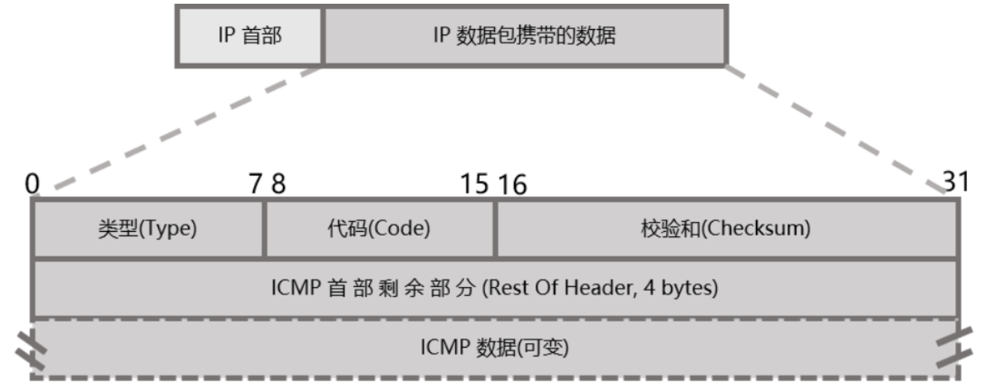

## 1.1 TCP/IP 协议族体系结构


### 1.1.2 网络层

ICMP 协议并非严格意义上的网络层协议，因为它使用处于同一层的 IP 协议提供的服务，即数据报文加上 ICMP 头之后还需要加上 IP 头。



#### CRC 循环冗余检验码

CRC 就是一种优秀的**检错码**：它把比特流看作多项式的系数。数据流看作多项式形式的被除数，设定一个生成多项作为除数。发送方需要在数据流末尾加上一段冗余码，**使得组合后的新数据流能够整除除数**，这段冗余码就是所谓的 CRC。

设除数为 $n$ 比特的生成多项式， 在原始数据流的末尾补 $n-1$ 个 0（为了使较短长度的数据流做除法后能得到 $n-1$ 位的 CRC），然后与生成多项式作除法得到 CRC，并记录在数据帧中。

接收方通过传过来的数据和 CRC，将 CRC 拼接在数据流的后面，除以相同的生成多项式计算余数，若余数为 0，代表未出错；否则代表有错误发生。

假设被除数是 0x97 = $10010111$，除数为 $x^8 + x^2 + x+ 1$，可以得到 CRC 为 $11101100$


### 1.1.4 应用层

应用层协议可能跳过传输层直接使用网络层提供的服务，比如 ping 程序和 OSPF 协议。应用层协议通常既可以使用 TCP 服务，又可以使用 UDP 服务，比如 DNS 协议。Linux 下通过 `/etc/services` 文件查看所有知名的应用层协议，以及它们都能使用哪些传输层服务。


## 1.4 测试网络

CentOS 虚拟机：

- IP 地址：192.168.163.131
- MAC 地址：00:0c:29:47:8b:e9
- 操作系统：CentOS Linux release 8.5.2111

Ubuntu 虚拟机：

- IP 地址：192.168.163.136
- MAC 地址：00:0c:29:32:5d:65
- 操作系统：Ubuntu 18.04.6 LTS

## 1.5 ARP 协议

### 1.5.3 使用 tcpdump 观察 ARP 通信过程

Ubuntu 上监听 IP 对应 `ens33` 网卡，并指定源地址和目标地址：

```shell
sudo tcpdump -i ens33 -ent '(dst 192.168.163.131 and src 192.168.163.136)or(dst 192.168.163.136 and src 192.168.163.131)'
```

Ubuntu 使用 telnet 尝试连接 CentOS，观察到 ARP 协议包为：

```shell
00:0c:29:32:5d:65 > 00:0c:29:47:8b:e9, ethertype IPv4 (0x0800), length 74: 192.168.163.136.50316 > 192.168.163.131.12345: Flags [S], seq 44897522, win 64240, options [mss 1460,sackOK,TS val 201056518 ecr 0,nop,wscale 7], length 0

00:0c:29:47:8b:e9 > 00:0c:29:32:5d:65, ethertype IPv4 (0x0800), length 60: 192.168.163.131.12345 > 192.168.163.136.50316: Flags [R.], seq 0, ack 44897523, win 0, length 0

# 源 IP 地址的 arp 询问报文
00:0c:29:47:8b:e9 > 00:0c:29:32:5d:65, ethertype ARP (0x0806), length 60: Request who-has 192.168.163.136 tell 192.168.163.131, length 46
# 目标 IP 地址的 arp 响应报文
00:0c:29:32:5d:65 > 00:0c:29:47:8b:e9, ethertype ARP (0x0806), length 42: Reply 192.168.163.136 is-at 00:0c:29:32:5d:65, length 28

00:0c:29:32:5d:65 > 00:0c:29:47:8b:e9, ethertype IPv4 (0x0800), length 74: 192.168.163.136.47820 > 192.168.163.131.12345: Flags [S], seq 1867858173, win 64240, options [mss 1460,sackOK,TS val 201071526 ecr 0,nop,wscale 7], length 0

00:0c:29:47:8b:e9 > 00:0c:29:32:5d:65, ethertype IPv4 (0x0800), length 60: 192.168.163.131.12345 > 192.168.163.136.47820: Flags [R.], seq 0, ack 1867858174, win 0, length 0
```

此时使用 `arp -a` 可以查询到：

```shell
? (192.168.163.131) at 00:0c:29:47:8b:e9 [ether] on ens33
_gateway (192.168.163.2) at 00:50:56:f7:24:85 [ether] on ens33
? (192.168.163.254) at 00:50:56:f5:a8:de [ether] on ens33
```

## 1.6 DNS 工作原理

### 1.6.2 Linux 下访问 DNS 服务

`/etc/resolv.conf` 文件存放了 DNS 服务器的 IP 地址：

```shell
nameserver 127.0.0.53
options edns0
search localdomain
```

使用 `host` 命令向 DNS 服务器 127.0.0.53 查询百度域名的 IP 地址：

```shell
www.baidu.com is an alias for www.a.shifen.com.
www.a.shifen.com has address 182.61.200.7
www.a.shifen.com has address 182.61.200.6
```

### 1.6.3 使用 tcpdump 观察 DNS 通信过程

使用 tcpdump 抓包，只抓取 domain（域名）服务的数据包：

```shell
sudo tcpdump -i ens33 -nt -s 500 port domain
```

使用 `host` 命令查询百度域名的 IP 地址，得到抓包结果为：

```shell
IP 192.168.163.136.55802 > 192.168.163.2.53: 6812+ [1au] A? www.baidu.com. (42)

IP 192.168.163.2.53 > 192.168.163.136.55802: 6812 3/0/1 CNAME www.a.shifen.com., A 182.61.200.6, A 182.61.200.7 (101)
```

## 1.7 socket 和 TCP/IP 协议族的关系

数据链路层、网络层、传输层协议是在内核中实现的，因此操作系统需要提供一组系统调用，使得应用程序能够访问这些协议提供的服务。

socket 提供了两点功能：

- 将应用程序数据从用户缓冲区中复制到 TCP/UDP 内核发送缓冲区，或者从 TCP/UDP 内核接收缓冲区中复制数据到用户缓冲区；
- 应用程序可以通过它们来修改内核中各项协议的某些头部信息或者其他数据结构

socket 不但可以访问内核的 TCP/IP 协议栈，而且可以访问其他网络协议栈（如 UNIX 本地域协议栈等）