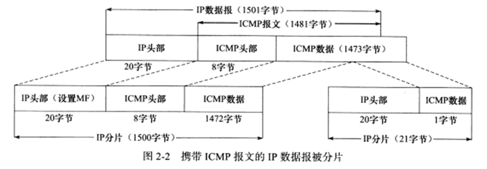

## 2.1 IP 服务的特点

IP 协议为上层协议提供**无状态、无连接、不可靠**的服务。

无状态指的是：IP 通信的双方不同步传输数据的状态信息，所有 IP 数据包的发送、传输和接收都是相互独立、没有上下文关系的。

无连接是指 IP 通信双方都不长久地维持对方地任何信息。

不可靠指的是：IP 数据报发送失败后，通知上层协议发送失败，而不会尝试重传。

## 2.3 IP 分片

IP 数据包地长度超过 MTU 时会被分片传输。分片可能发生在发送端，也可能发生在中转路由器上。而且可能在传输过程中被多次分片。

IP 头部的**数据报标识、标志和片偏移**为分片和重组提供了信息。一个 IP 数据包具有相同的标识值，但具有不同的片偏移。除了最后一个分片外，其他分片都将被设置为 MF 标志。

MTU 一般是 1500 字节，它携带的 IP 数据报的数据部分最多是 1480 字节，IP 头部需要占用 20 字节。

IP 模块重组该 ICMP 报文的时候，只需要一份 ICMP 头部信息，因此第二份 IP 数据包不包含 ICMP 头部。

