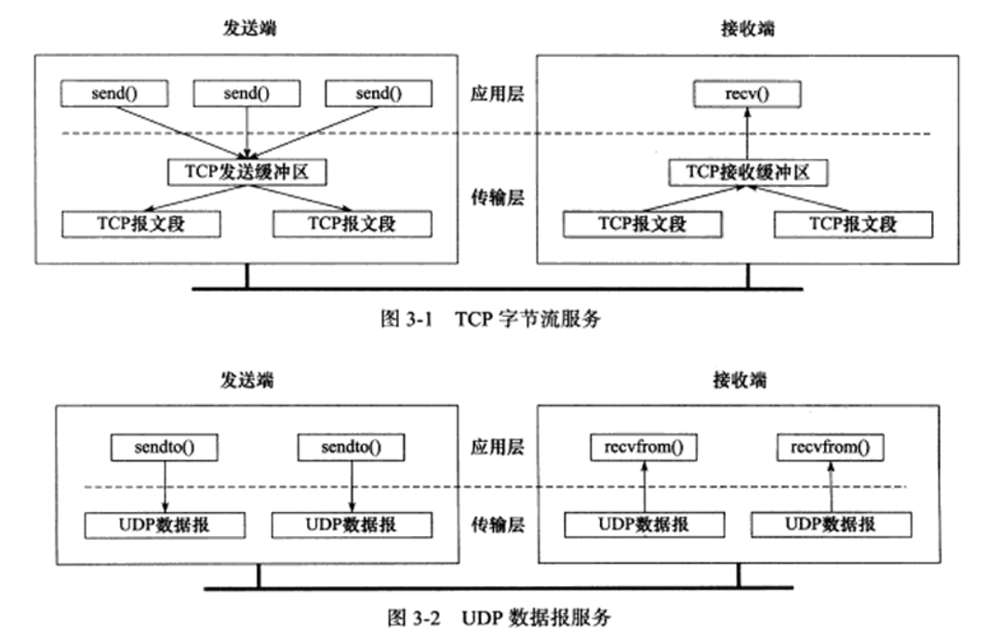
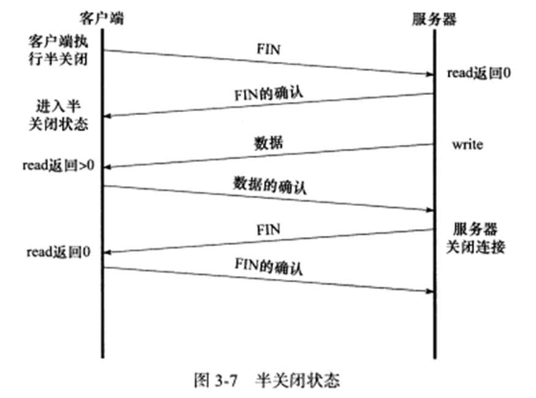
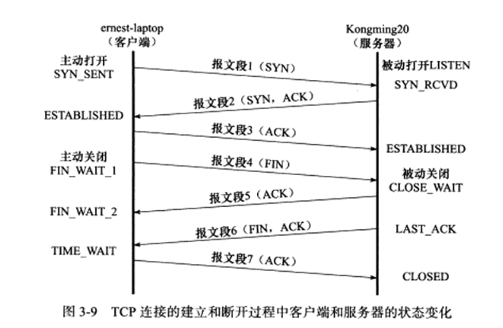
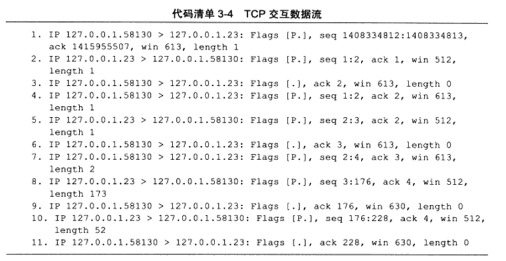
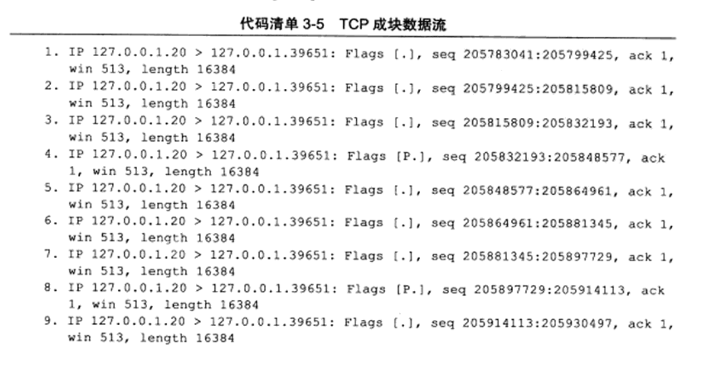
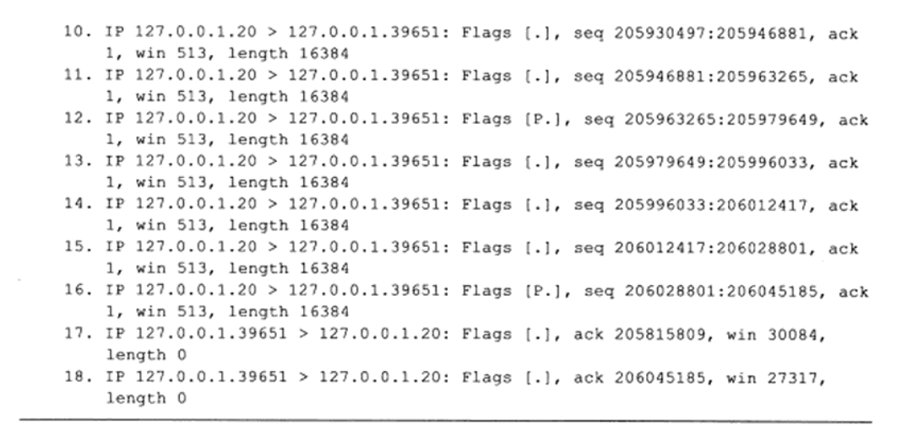
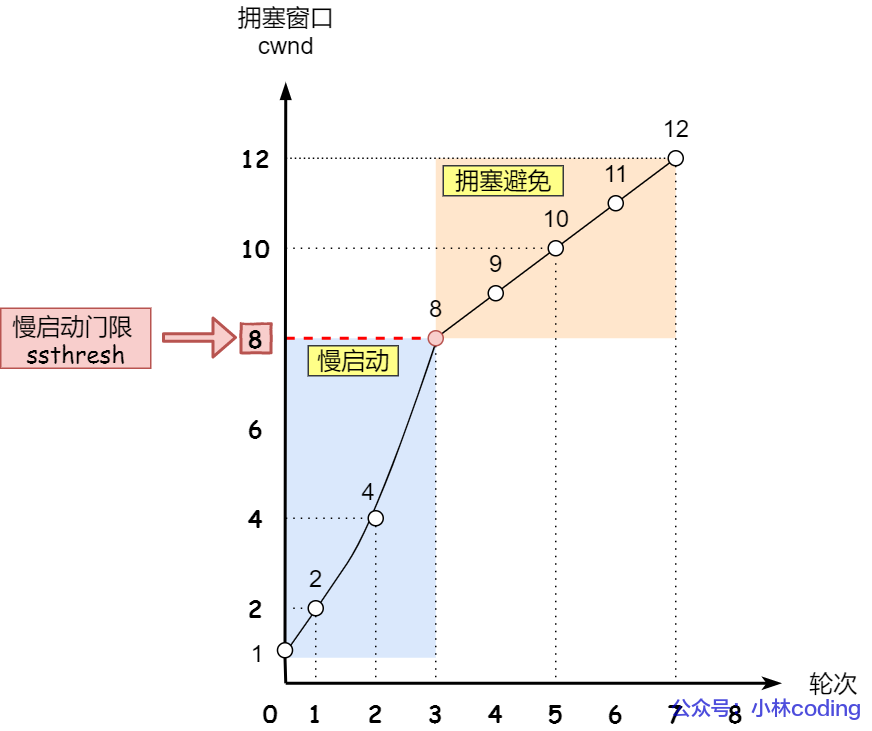
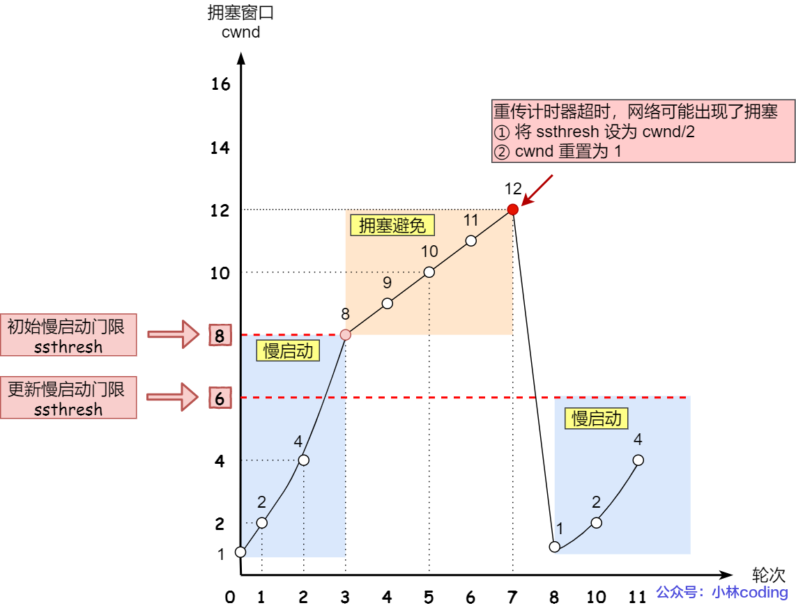
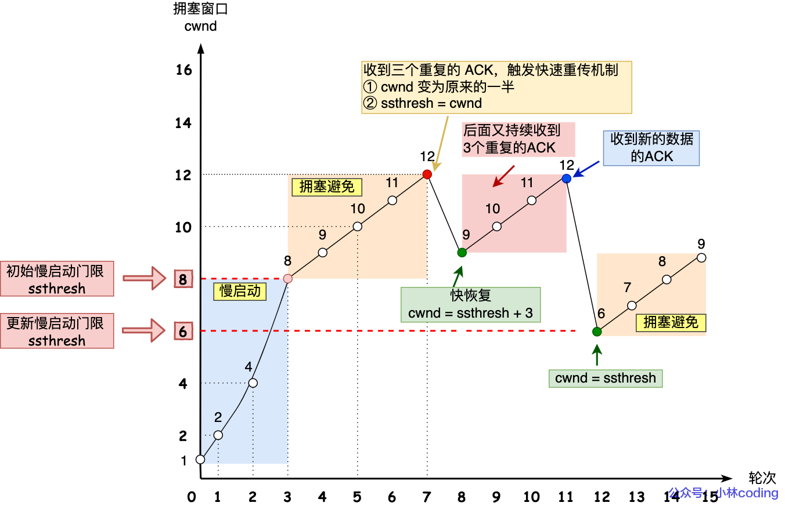

## 3.1 TCP 服务的特点

发送端执行的写操作次数和接收端执行的读操作次数之间没有任何数量关系，这就是字节流的概念：应用程序对数据的发送和接收没有边界限制。UDP 则必须对每一个数据报执行读写操作。

TCP 提供可靠的服务，具备超时重传，按序交付等特点。

UDP 和 IP 一样，提供不可靠的服务，它们都需要上层协议来处理数据确认和超时重传。

## 3.3 TCP 连接的建立和关闭

**同步报文和结束报文**都比较特殊，即使没有携带任何数据，它也要占用一个序号值，即**接下来对方的 ACK = SEQ + 1**

### 3.3 半关闭状态

TCP 连接是**全双工**的，它允许两个方向上的连接独立关闭。通信的一方可以发送结束报文段给对方，表明**完成了自己数据的发送，但仍允许接收对方的数据**，直到对方也发送结束报文段以关闭连接。

## 3.4 TCP 状态转移

### 3.4.2 TIME_WAIT 状态

 TIME_WAIT 状态存在的原因：

- 可靠地终止 TCP 连接
  - ACK 报文不会重发，假设报文段 7 丢弃，那么服务端会重发报文段 6，如果客户端关闭了连接会回复 RST 报文，服务端期望的是 ACK 报文
- 保证让迟来的 TCP 报文有足够的时间被丢弃
  - 假设不存在该状态，程序立刻允许再次与服务器相同端口重连，这可能导致此前网络中延迟的**数据报文或者 FIN 报文发送到服务端**，引发服务端接收错误

TIME_WAIT 持续 2MSL 的原因是确保两个方向上**延迟的报文**都能够消失在网络，从而保证了上述原因 2

如果希望**服务端**主动关闭连接后能立刻重连，可以通过 socket 的 SO_REUSEADDR 强制进程立即使用处于 TIME_WAIT 状态的端口。

## 3.5 复位报文段

RST 即复位报文段，通知对方关闭连接或重新建立连接。一旦发送了复位报文段，所有排队等待发送的请求都将被丢弃。

当出现如下两种情况时，会得到对方发来的 RST 报文：

- 访问不存在的端口
- 客户端向服务端正处于 TIME_WAIT 的端口发送 SYN 请求

## 3.6 TCP 交互数据流

TCP 报文段携带的应用程序数据分为两种：交互数据和成块数据。

- 交互数据对实时性要求较高，比如 telnet、ssh 等；

- 成块数据对传输效率要求较高，其长度通常为 TCP 报文段允许的最大数据长度，例如 ftp 等

使用 telnet 登录本机，并执行 `ls` 命令，可以得到：

首先输入 `l`，服务端回显 `l`；接着服务端回显 `s`，当输入回车和流结束符后，报文段 8 携带了 `ls` 的输出内容。

服务端对客户端的响应报文 2、5、8、10，都属于**延迟确认**，显示为 `seq x:x+y`，即对客户端报文的确认还有回复数据一起发送：它不马上确认上次收到的数据，而是在一段延迟时间后查看本端是否有数据需要发送。如果有则和确认信息一起发出。**延迟确认可以减少发送的 TCP 报文段的数量**

TCP 延迟确认的策略：

- 当有响应数据要发送时，ACK 会随着响应数据一起立刻发送给对方
- 当没有响应数据要发送时，ACK 将会延迟一段时间，以等待是否有响应数据可以一起发送
- 如果在延迟等待发送 ACK 期间，对方的第二个数据报文又到达了，这时就会立刻发送 ACK

#### Nagle 算法

使用 Nagle 算法，该算法的思路是延时处理，只有满足下面两个条件中的任意一个条件，才能可以发送数据：

- 条件一：要等到窗口大小 >= `MSS` 并且 数据大小 >= `MSS`；
- 条件二：收到之前发送数据的 `ack` 回包；

TCP 连接的双方在任意时刻都最多只发送一个未被确认的 TCP 报文段，在该 TCP 报文段的确认到达之前不能发送其他 TCP 报文段。另一方面，发送方在等待确认的同时收集本端需要发送的微量数据，并在确认到来时以一个 TCP 将它们全部发出。

## 3.7 TCP 成块数据流

使用 FTP 传输一个大文件，同时抓包分析：

客户端发送的最后两个 TCP 报文段 17 和 18，它们分别是对  TCP 报文段 2 和 16 的确认。由此可见，当传输大量大块数据的时候，发送方会连续发送多个 TCP 报文段，接收方可以一次确认所有这些报文段。

另外一个值得注意的地方是，服务器每发送 4 个 TCP 报文段就传送一个 PSH 标志 `Flags [P.]` 给客户端，以通知客户端的应用程序尽快读取数据。

## 3.8 带外数据

TCP 利用头部的紧急指针标志和紧急指针两个字段，给应用程序提供了一种紧急方式。TCP 利用传输普通数据的连接传输紧急数据，这种紧急数据的含义同**带外数据**类似。

## 3.9 TCP 超时重传

TCP 为每个 TCP 报文段都维护一个重传定时器，如果超时时间内未收到接收方的应答，TCP 将重传报文段并重置定时器。

当数据包连续丢失时，TCP 会根据配置执行 `n` 次重传，每次重传超时时间都增加一倍。**类似于连接和断开的超时重传机制**。若全部重传失败，底层的 IP 和 ARP 开始接管，直到客户端放弃连接。

虽然超时会导致报文重传，但是重传可以发生在超时之前，即**快速重传**。

## 3.10 拥塞控制

### 3.10.1 拥塞控制概述

拥塞控制的最终受控变量是发送端向网络一次写入的数据量，称为 SWND 发送窗口。TCP 报文的最大长度称为 SMSS，其值一般等于 MSS

虽然接收方可以根据 RWND 控制发送窗口的大小，但是这显然不够。发送端引入了一个成为 CWND 的状态变量，实际的 SWND 的值是 `min(SWND, CWND)`

### 3.10.2 慢启动和拥塞避免

TCP 连接建立好之后，CWND 将被设置为初始值，此后发送端**每收到一个确认**，CWND 就按照如下方式增加：
$$
\text{CNWD = CNWD + }\min(N, SMSS)
$$
其中 $N$ 是此次确认中包含的之前未被确认的字节数，这样 CWND 按照指数形式扩大。

当拥塞窗口 `cwnd` 「超过」慢启动门限 `ssthresh` 就会进入拥塞避免算法：**每当收到一个 ACK 时，cwnd 增加 1/CWND**。这样超过门限后，就会进入线性增长的状态。

发送端判断拥塞发生的依据为：

- 超时重传
- 接收到重复的确认报文段

当发生了「超时重传」，则就会使用拥塞发生算法。ssthresh 和 cwnd 的值会发生变化：

- `ssthresh` 设为 `cwnd/2`，
- `cwnd` 重置为 `1` （是恢复为 cwnd 初始化值，我这里假定 cwnd 初始化值 1）

### 3.10.3 **快速重传**和快速恢复

快速重传时拥塞控制算法的变化：

- `cwnd = cwnd/2` ，也就是设置为原来的一半;
- `ssthresh = cwnd`;

然后，进入快速恢复算法如下：

- 拥塞窗口 `cwnd = ssthresh + 3` （ 3 的意思是确认有 3 个数据包被收到了）；
- 重传丢失的数据包；
- 如果再收到重复的 ACK，那么 cwnd 增加 1；
- 如果收到新数据的 ACK 后，把 cwnd 设置为第一步中的 ssthresh 的值，原因是该 ACK 确认了新的数据，说明从 duplicated ACK 时的数据都已收到，该恢复过程已经结束，可以回到恢复之前的状态了，也即再次进入拥塞避免状态；

快速恢复算法的变化过程如下图：

