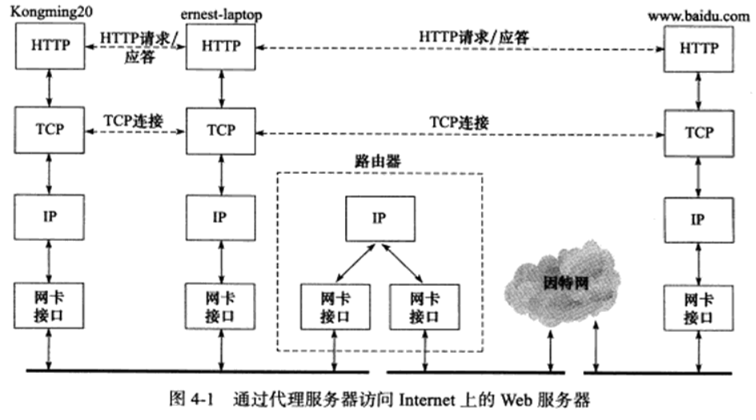
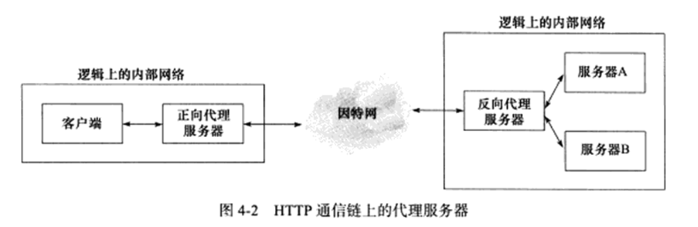
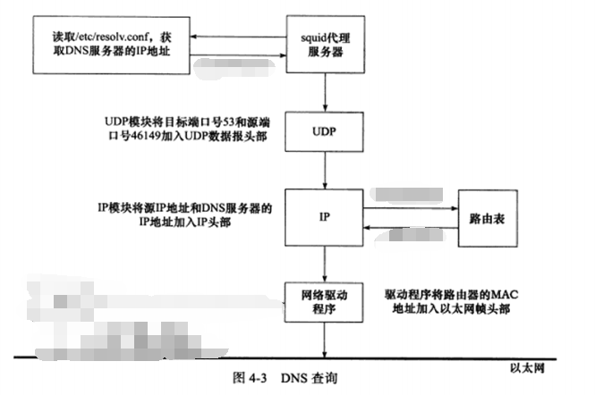
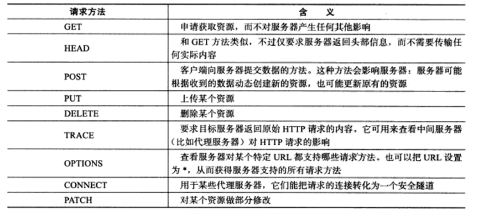
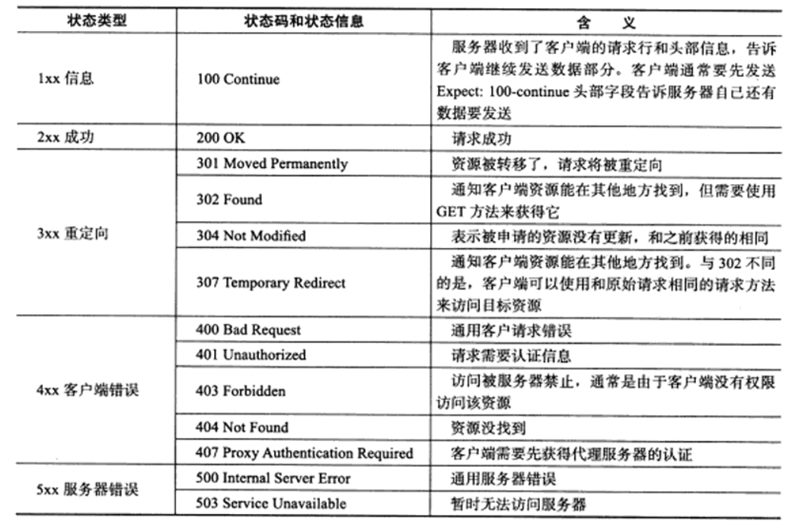

## 4.1 实例总图

如下图所示，在 Ubuntu（对应下图中的 **kongming20**）上运行 `wget` 客户端程序，在 CentOS（对应下图的 **ernest-laptop**）上运行 squid 代理服务器程序。客户端通过代理服务器的中转，获取互联网上的主机 www.baidu.com 的首页文档 index.html



为了将 CentOS-192.168.163.131 设置为 Ubuntu-192.168.163.136 的代理服务器，需要在 Ubuntu 上设置临时环境变量 http_proxy：

```bash
export http_proxy="http://192.168.163.131:3128"
```

其中，3128 是 squid 服务器默认使用的端口号。在这之后，Ubuntu-192.168.163.136 访问互联网的任何 HTTP 请求，都会首先发送到 CentOS-192.168.163.131 的 3128 端口。

## 4.2 部署代理服务器

### 4.2.1 HTTP 代理服务器的工作原理

在 HTTP 通信链上，客户端和目标服务器之间通常存在某些中转代理服务器，它们提供对目标资源的中转访问。一个 HTTP 请求可能被多个代理服务器转发，后面的服务器称为前面服务器的上游服务器。代理服务器按照其使用方式和作用，分为**正向代理服务器、反向代理服务器和透明代理服务器**。

正向代理要求客户端自己设置代理服务器的地址。客户的每次请求都将直接发送到该代理服务器，并由代理服务器来请求目标资源。比如处于防火墙内的局域网机器要访问 Internet，或者要访问一些被屏蔽掉的国外网站，就需要使用正向代理服务器。

反向代理则被设置在服务器端，因而客户端无须进行任何设置。反向代理是指用代理服务器来接收 Internet 上的连接请求，然后将请求转发给内部网络上的服务器，并将从内部服务器上得到的结果返回给客户端。这种情况下，代理服务器对外就表现为一个真实的服务器。各大网站通常分区域设置了多个代理服务器，所以在不同的地方 `ping` 同一个域名可能得到不同的 IP 地址，因为这些 IP 地址实际上是代理服务器的 IP 地址。下图显示了正向代理服务器和反向代理服务器在 HTTP 通信链上的逻辑位置。



透明代理只能设置在网关上。用户访问 Internet 的数据报必然都经过网关，如果在网关上设置代理，则该代理对用户来说显然是透明的。透明代理可以看作正向代理的一种特殊情况。

### 4.2.2 部署 squid 代理服务器

在 CentOS 上安装 squid：

```shell
sudo yum install -y squid
```

查看 squid 服务器的配置文件 `/etc/squid3/squid.conf`，其中默认配置好了如下规则：

```shell
# Example rule allowing access from your local networks.
# Adapt to list your (internal) IP networks from where browsing
# should be allowed
acl localnet src 0.0.0.1-0.255.255.255	# RFC 1122 "this" network (LAN)
acl localnet src 192.168.0.0/16		# RFC 1918 local private network (LAN)

acl SSL_ports port 443
acl Safe_ports port 80		# http
acl Safe_ports port 443		# https

# Example rule allowing access from your local networks.
# Adapt localnet in the ACL section to list your (internal) IP networks
# from where browsing should be allowed
http_access allow localnet
```

其中 `acl localnet src 192.168.0.0/16` 和 `http_access allow localnet` 的含义是允许局域网 `192.168.0.0/16` 上的所有机器通过该代理服务器访问 Web 服务器。

## 4.3 使用 tcpdump 抓取传输数据包

在执行 `wget` 之前，使用 `arp -a` 查看 ARP 缓存中是否有 192.168.163.131 这一项，如果有则执行指令 `sudo arp -d 192.168.163.131` 删除 ARP 缓存。在执行操作之前，首先在 Ubuntu 的一个终端中开启 `tcmpdmp`：

```shell
sudo tcpdump -s 2000 -i ens33 -ntX '(src 192.168.163.131) or (dst 192.168.163.131) or (arp)'
```

然后在另一个终端中执行指令：

```shell
wget --header="Connection: close" http://www.baidu.com/index.html
```

其中 `--header="Connection: close"` 参数的作用是为 HTTP 请求添加一个自定义头信息字段。在 HTTP 协议中，`Connection` 头部字段用于指示客户端和服务端之间连接管理的行为。

`Connection: close` 指示服务器在完成对此次 HTTP 请求的响应后关闭 TCP 连接，而不是保持连接打开以供后续请求复用（即持久连接）。在 HTTP/1.1 中，默认情况下如果没有明确声明，服务器通常会保持连接打开以提高性能，减少建立新连接的开销。但有时出于调试或者其他特殊目的，用户可能会希望每次请求完成后都关闭连接。

`wget` 终端中得到如下输出，证明 HTTP 请求确实是先被送到代理服务器的 3128 端口，并且代理服务器正确地返回了百度的首页文件：

```shell
--2024-04-23 12:36:24--  http://www.baidu.com/index.html
Connecting to 192.168.163.131:3128... connected.
Proxy request sent, awaiting response... 200 OK
Length: 2381 (2.3K) [text/html]
Saving to: ‘index.html’

index.html          100%[===================>]   2.33K  --.-KB/s    in 0s      

2024-04-23 12:36:24 (188 MB/s) - ‘index.html’ saved [2381/2381]
```

这次通信的完整 `tcpdump` 输出内容如下所示：

```shell
tcpdump: verbose output suppressed, use -v or -vv for full protocol decode
listening on ens33, link-type EN10MB (Ethernet), capture size 2000 bytes
# ARP 广播
ARP, Request who-has 192.168.163.131 tell 192.168.163.136, length 28
	0x0000:  0001 0800 0604 0001 000c 2932 5d65 c0a8  ..........)2]e..
	0x0010:  a388 0000 0000 0000 c0a8 a383            ............
ARP, Reply 192.168.163.131 is-at 00:0c:29:47:8b:e9, length 46
	0x0000:  0001 0800 0604 0002 000c 2947 8be9 c0a8  ..........)G....
	0x0010:  a383 000c 2932 5d65 c0a8 a388 0000 0000  ....)2]e........
	0x0020:  0000 0000 0000 0000 0000 0000 0000       ..............
# 三次握手创建连接
IP 192.168.163.136.57252 > 192.168.163.131.3128: Flags [S], seq 887866190, win 64240, options [mss 1460,sackOK,TS val 4054730803 ecr 0,nop,wscale 7], length 0
	0x0000:  4500 003c 06e8 4000 4006 6b77 c0a8 a388  E..<..@.@.kw....
	0x0010:  c0a8 a383 dfa4 0c38 34eb c34e 0000 0000  .......84..N....
	0x0020:  a002 faf0 c88b 0000 0204 05b4 0402 080a  ................
	0x0030:  f1ae 4833 0000 0000 0103 0307            ..H3........
IP 192.168.163.131.3128 > 192.168.163.136.57252: Flags [S.], seq 2106291571, ack 887866191, win 65160, options [mss 1460,sackOK,TS val 2476478902 ecr 4054730803,nop,wscale 7], length 0
	0x0000:  4500 003c 0000 4000 4006 725f c0a8 a383  E..<..@.@.r_....
	0x0010:  c0a8 a388 0c38 dfa4 7d8b 7573 34eb c34f  .....8..}.us4..O
	0x0020:  a012 fe88 cabe 0000 0204 05b4 0402 080a  ................
	0x0030:  939c 11b6 f1ae 4833 0103 0307            ......H3....
IP 192.168.163.136.57252 > 192.168.163.131.3128: Flags [.], ack 1, win 502, options [nop,nop,TS val 4054730805 ecr 2476478902], length 0
	0x0000:  4500 0034 06e9 4000 4006 6b7e c0a8 a388  E..4..@.@.k~....
	0x0010:  c0a8 a383 dfa4 0c38 34eb c34f 7d8b 7574  .......84..O}.ut
	0x0020:  8010 01f6 c883 0000 0101 080a f1ae 4835  ..............H5
	0x0030:  939c 11b6                                ....
# TCP 通信过程：Part1
IP 192.168.163.136.57252 > 192.168.163.131.3128: Flags [P.], seq 1:196, ack 1, win 502, options [nop,nop,TS val 4054730805 ecr 2476478902], length 195
	0x0000:  4500 00f7 06ea 4000 4006 6aba c0a8 a388  E.....@.@.j.....
	0x0010:  c0a8 a383 dfa4 0c38 34eb c34f 7d8b 7574  .......84..O}.ut
	0x0020:  8018 01f6 c946 0000 0101 080a f1ae 4835  .....F........H5
	0x0030:  939c 11b6 4745 5420 6874 7470 3a2f 2f77  ....GET.http://w
	0x0040:  7777 2e62 6169 6475 2e63 6f6d 2f69 6e64  ww.baidu.com/ind
	0x0050:  6578 2e68 746d 6c20 4854 5450 2f31 2e31  ex.html.HTTP/1.1
	0x0060:  0d0a 5573 6572 2d41 6765 6e74 3a20 5767  ..User-Agent:.Wg
	0x0070:  6574 2f31 2e31 392e 3420 286c 696e 7578  et/1.19.4.(linux
	0x0080:  2d67 6e75 290d 0a41 6363 6570 743a 202a  -gnu)..Accept:.*
	0x0090:  2f2a 0d0a 4163 6365 7074 2d45 6e63 6f64  /*..Accept-Encod
	0x00a0:  696e 673a 2069 6465 6e74 6974 790d 0a48  ing:.identity..H
	0x00b0:  6f73 743a 2077 7777 2e62 6169 6475 2e63  ost:.www.baidu.c
	0x00c0:  6f6d 0d0a 436f 6e6e 6563 7469 6f6e 3a20  om..Connection:.
	0x00d0:  636c 6f73 650d 0a50 726f 7879 2d43 6f6e  close..Proxy-Con
	0x00e0:  6e65 6374 696f 6e3a 204b 6565 702d 416c  nection:.Keep-Al
	0x00f0:  6976 650d 0a0d 0a                        ive....
IP 192.168.163.131.3128 > 192.168.163.136.57252: Flags [.], ack 196, win 508, options [nop,nop,TS val 2476478903 ecr 4054730805], length 0
	0x0000:  4500 0034 7067 4000 4006 0200 c0a8 a383  E..4pg@.@.......
	0x0010:  c0a8 a388 0c38 dfa4 7d8b 7574 34eb c412  .....8..}.ut4...
	0x0020:  8010 01fc f551 0000 0101 080a 939c 11b7  .....Q..........
	0x0030:  f1ae 4835                                ..H5
# TCP 通信过程：Part2
IP 192.168.163.131.57125 > 192.168.163.2.53: 57664+ PTR? 136.163.168.192.in-addr.arpa. (46)
	0x0000:  4500 004a 974b 4000 4011 db80 c0a8 a383  E..J.K@.@.......
	0x0010:  c0a8 a302 df25 0035 0036 7d2a e140 0100  .....%.5.6}*.@..
	0x0020:  0001 0000 0000 0000 0331 3336 0331 3633  .........136.163
	0x0030:  0331 3638 0331 3932 0769 6e2d 6164 6472  .168.192.in-addr
	0x0040:  0461 7270 6100 000c 0001                 .arpa.....
IP 192.168.163.131.57125 > 192.168.163.2.53: 13878+ A? www.baidu.com. (31)
	0x0000:  4500 003b 974c 4000 4011 db8e c0a8 a383  E..;.L@.@.......
	0x0010:  c0a8 a302 df25 0035 0027 6637 3636 0100  .....%.5.'f766..
	0x0020:  0001 0000 0000 0000 0377 7777 0562 6169  .........www.bai
	0x0030:  6475 0363 6f6d 0000 0100 01              du.com.....
IP 192.168.163.131.57125 > 192.168.163.2.53: 30854+ AAAA? www.baidu.com. (31)
	0x0000:  4500 003b 974d 4000 4011 db8d c0a8 a383  E..;.M@.@.......
	0x0010:  c0a8 a302 df25 0035 0027 08e7 7886 0100  .....%.5.'..x...
	0x0020:  0001 0000 0000 0000 0377 7777 0562 6169  .........www.bai
	0x0030:  6475 0363 6f6d 0000 1c00 01              du.com.....
IP 192.168.163.2.53 > 192.168.163.131.57125: 57664 NXDomain 0/1/0 (101)
	0x0000:  4500 0081 33e1 0000 8011 3eb4 c0a8 a302  E...3.....>.....
	0x0010:  c0a8 a383 0035 df25 006d a862 e140 8183  .....5.%.m.b.@..
	0x0020:  0001 0000 0001 0000 0331 3336 0331 3633  .........136.163
	0x0030:  0331 3638 0331 3932 0769 6e2d 6164 6472  .168.192.in-addr
	0x0040:  0461 7270 6100 000c 0001 0331 3638 0331  .arpa......168.1
	0x0050:  3932 0749 4e2d 4144 4452 0441 5250 4100  92.IN-ADDR.ARPA.
	0x0060:  0006 0001 0000 0005 0017 c02e 0000 0000  ................
	0x0070:  0000 0070 8000 001c 2000 093a 8000 0151  ...p.......:...Q
	0x0080:  80                                       .
IP 192.168.163.2.53 > 192.168.163.131.57125: 13878 3/0/0 CNAME www.a.shifen.com., A 182.61.200.7, A 182.61.200.6 (90)
	0x0000:  4500 0076 33e2 0000 8011 3ebe c0a8 a302  E..v3.....>.....
	0x0010:  c0a8 a383 0035 df25 0062 efaf 3636 8180  .....5.%.b..66..
	0x0020:  0001 0003 0000 0000 0377 7777 0562 6169  .........www.bai
	0x0030:  6475 0363 6f6d 0000 0100 01c0 0c00 0500  du.com..........
	0x0040:  0100 0000 0500 0f03 7777 7701 6106 7368  ........www.a.sh
	0x0050:  6966 656e c016 c02b 0001 0001 0000 0005  ifen...+........
	0x0060:  0004 b63d c807 c02b 0001 0001 0000 0005  ...=...+........
	0x0070:  0004 b63d c806                           ...=..
IP 192.168.163.2.53 > 192.168.163.131.57125: 30854 1/1/0 CNAME www.a.shifen.com. (115)
	0x0000:  4500 008f 33e3 0000 8011 3ea4 c0a8 a302  E...3.....>.....
	0x0010:  c0a8 a383 0035 df25 007b ad00 7886 8180  .....5.%.{..x...
	0x0020:  0001 0001 0001 0000 0377 7777 0562 6169  .........www.bai
	0x0030:  6475 0363 6f6d 0000 1c00 01c0 0c00 0500  du.com..........
	0x0040:  0100 0000 0500 0f03 7777 7701 6106 7368  ........www.a.sh
	0x0050:  6966 656e c016 c02f 0006 0001 0000 0005  ifen.../........
	0x0060:  002d 036e 7331 c02f 1062 6169 6475 5f64  .-.ns1./.baidu_d
	0x0070:  6e73 5f6d 6173 7465 72c0 108f 4da3 7f00  ns_master...M...
	0x0080:  0000 0500 0000 0500 278d 0000 000e 10    ........'......
# TCP 通信过程：Part3
IP 192.168.163.131.47284 > 182.61.200.7.80: Flags [S], seq 2633321633, win 64240, options [mss 1460,sackOK,TS val 3204462849 ecr 0,nop,wscale 7], length 0
	0x0000:  4500 003c f921 4000 4006 5f29 c0a8 a383  E..<.!@.@._)....
	0x0010:  b63d c807 b8b4 0050 9cf5 4ca1 0000 0000  .=.....P..L.....
	0x0020:  a002 faf0 d000 0000 0204 05b4 0402 080a  ................
	0x0030:  bf00 3901 0000 0000 0103 0307            ..9.........
IP 182.61.200.7.80 > 192.168.163.131.47284: Flags [S.], seq 1081416808, ack 2633321634, win 64240, options [mss 1460], length 0
	0x0000:  4500 002c 33e4 0000 8006 2477 b63d c807  E..,3.....$w.=..
	0x0010:  c0a8 a383 0050 b8b4 4075 1c68 9cf5 4ca2  .....P..@u.h..L.
	0x0020:  6012 faf0 bb3a 0000 0204 05b4 0000       `....:........
IP 192.168.163.131.47284 > 182.61.200.7.80: Flags [.], ack 1, win 64240, length 0
	0x0000:  4500 0028 f922 4000 4006 5f3c c0a8 a383  E..(."@.@._<....
	0x0010:  b63d c807 b8b4 0050 9cf5 4ca2 4075 1c69  .=.....P..L.@u.i
	0x0020:  5010 faf0 d2f7 0000 0000 0000 0000       P.............
IP 192.168.163.131.47284 > 182.61.200.7.80: Flags [P.], seq 1:311, ack 1, win 64240, length 310: HTTP: GET /index.html HTTP/1.1
	0x0000:  4500 015e f923 4000 4006 5e05 c0a8 a383  E..^.#@.@.^.....
	0x0010:  b63d c807 b8b4 0050 9cf5 4ca2 4075 1c69  .=.....P..L.@u.i
	0x0020:  5018 faf0 2530 0000 4745 5420 2f69 6e64  P...%0..GET./ind
	0x0030:  6578 2e68 746d 6c20 4854 5450 2f31 2e31  ex.html.HTTP/1.1
	0x0040:  0d0a 4966 2d4d 6f64 6966 6965 642d 5369  ..If-Modified-Si
	0x0050:  6e63 653a 2054 7565 2c20 3233 2041 7072  nce:.Tue,.23.Apr
	0x0060:  2032 3032 3420 3034 3a33 343a 3335 2047  .2024.04:34:35.G
	0x0070:  4d54 0d0a 5573 6572 2d41 6765 6e74 3a20  MT..User-Agent:.
	0x0080:  5767 6574 2f31 2e31 392e 3420 286c 696e  Wget/1.19.4.(lin
	0x0090:  7578 2d67 6e75 290d 0a41 6363 6570 743a  ux-gnu)..Accept:
	0x00a0:  202a 2f2a 0d0a 4163 6365 7074 2d45 6e63  .*/*..Accept-Enc
	0x00b0:  6f64 696e 673a 2069 6465 6e74 6974 790d  oding:.identity.
	0x00c0:  0a48 6f73 743a 2077 7777 2e62 6169 6475  .Host:.www.baidu
	0x00d0:  2e63 6f6d 0d0a 5669 613a 2031 2e31 206c  .com..Via:.1.1.l
	0x00e0:  6f63 616c 686f 7374 2e6c 6f63 616c 646f  ocalhost.localdo
	0x00f0:  6d61 696e 2028 7371 7569 642f 342e 3135  main.(squid/4.15
	0x0100:  290d 0a58 2d46 6f72 7761 7264 6564 2d46  )..X-Forwarded-F
	0x0110:  6f72 3a20 3139 322e 3136 382e 3136 332e  or:.192.168.163.
	0x0120:  3133 360d 0a43 6163 6865 2d43 6f6e 7472  136..Cache-Contr
	0x0130:  6f6c 3a20 6d61 782d 6167 653d 3235 3932  ol:.max-age=2592
	0x0140:  3030 0d0a 436f 6e6e 6563 7469 6f6e 3a20  00..Connection:.
	0x0150:  6b65 6570 2d61 6c69 7665 0d0a 0d0a       keep-alive....
IP 182.61.200.7.80 > 192.168.163.131.47284: Flags [.], ack 311, win 64240, length 0
	0x0000:  4500 0028 33e5 0000 8006 247a b63d c807  E..(3.....$z.=..
	0x0010:  c0a8 a383 0050 b8b4 4075 1c69 9cf5 4dd8  .....P..@u.i..M.
	0x0020:  5010 faf0 d1c1 0000 0000 0000 0000       P.............
IP 182.61.200.7.80 > 192.168.163.131.47284: Flags [P.], seq 1:629, ack 311, win 64240, length 628: HTTP: HTTP/1.1 200 OK
	0x0000:  4500 029c 33e6 0000 8006 2205 b63d c807  E...3....."..=..
	0x0010:  c0a8 a383 0050 b8b4 4075 1c69 9cf5 4dd8  .....P..@u.i..M.
	0x0020:  5018 faf0 dce0 0000 4854 5450 2f31 2e31  P.......HTTP/1.1
	0x0030:  2032 3030 204f 4b0d 0a43 6f6e 7465 6e74  .200.OK..Content
	0x0040:  2d4c 656e 6774 683a 2032 3338 310d 0a43  -Length:.2381..C
	0x0050:  6f6e 7465 6e74 2d54 7970 653a 2074 6578  ontent-Type:.tex
	0x0060:  742f 6874 6d6c 0d0a 5365 7276 6572 3a20  t/html..Server:.
	0x0070:  6266 650d 0a44 6174 653a 2054 7565 2c20  bfe..Date:.Tue,.
	0x0080:  3233 2041 7072 2032 3032 3420 3034 3a33  23.Apr.2024.04:3
	0x0090:  363a 3234 2047 4d54 0d0a 0d0a 3c21 444f  6:24.GMT....<!DO
	0x00a0:  4354 5950 4520 6874 6d6c 3e0d 0a3c 212d  CTYPE.html>..<!-
	0x00b0:  2d53 5441 5455 5320 4f4b 2d2d 3e3c 6874  -STATUS.OK--><ht
	0x00c0:  6d6c 3e20 3c68 6561 643e 3c6d 6574 6120  ml>.<head><meta.
	0x00d0:  6874 7470 2d65 7175 6976 3d63 6f6e 7465  http-equiv=conte
	0x00e0:  6e74 2d74 7970 6520 636f 6e74 656e 743d  nt-type.content=
	0x00f0:  7465 7874 2f68 746d 6c3b 6368 6172 7365  text/html;charse
	0x0100:  743d 7574 662d 383e 3c6d 6574 6120 6874  t=utf-8><meta.ht
	0x0110:  7470 2d65 7175 6976 3d58 2d55 412d 436f  tp-equiv=X-UA-Co
	0x0120:  6d70 6174 6962 6c65 2063 6f6e 7465 6e74  mpatible.content
	0x0130:  3d49 453d 4564 6765 3e3c 6d65 7461 2063  =IE=Edge><meta.c
	0x0140:  6f6e 7465 6e74 3d61 6c77 6179 7320 6e61  ontent=always.na
	0x0150:  6d65 3d72 6566 6572 7265 723e 3c6c 696e  me=referrer><lin
	0x0160:  6b20 7265 6c3d 7374 796c 6573 6865 6574  k.rel=stylesheet
	0x0170:  2074 7970 653d 7465 7874 2f63 7373 2068  .type=text/css.h
	0x0180:  7265 663d 6874 7470 3a2f 2f73 312e 6264  ref=http://s1.bd
	0x0190:  7374 6174 6963 2e63 6f6d 2f72 2f77 7777  static.com/r/www
	0x01a0:  2f63 6163 6865 2f62 646f 727a 2f62 6169  /cache/bdorz/bai
	0x01b0:  6475 2e6d 696e 2e63 7373 3e3c 7469 746c  du.min.css><titl
	0x01c0:  653e e799 bee5 baa6 e4b8 80e4 b88b efbc  e>..............
	0x01d0:  8ce4 bda0 e5b0 b1e7 9fa5 e981 933c 2f74  .............</t
	0x01e0:  6974 6c65 3e3c 2f68 6561 643e 203c 626f  itle></head>.<bo
	0x01f0:  6479 206c 696e 6b3d 2330 3030 3063 633e  dy.link=#0000cc>
	0x0200:  203c 6469 7620 6964 3d77 7261 7070 6572  .<div.id=wrapper
	0x0210:  3e20 3c64 6976 2069 643d 6865 6164 3e20  >.<div.id=head>.
	0x0220:  3c64 6976 2063 6c61 7373 3d68 6561 645f  <div.class=head_
	0x0230:  7772 6170 7065 723e 203c 6469 7620 636c  wrapper>.<div.cl
	0x0240:  6173 733d 735f 666f 726d 3e20 3c64 6976  ass=s_form>.<div
	0x0250:  2063 6c61 7373 3d73 5f66 6f72 6d5f 7772  .class=s_form_wr
	0x0260:  6170 7065 723e 203c 6469 7620 6964 3d6c  apper>.<div.id=l
	0x0270:  673e 203c 696d 6720 6869 6465 666f 6375  g>. 192.168.163.131.47284: Flags [P.], seq 629:2498, ack 311, win 64240, length 1869: HTTP
	0x0000:  4500 0775 33e7 0000 8006 1d2b b63d c807  E..u3......+.=..
	0x0010:  c0a8 a383 0050 b8b4 4075 1edd 9cf5 4dd8  .....P..@u....M.
	0x0020:  5018 faf0 e9d8 0000 6d67 2f62 645f 6c6f  P.......mg/bd_lo
	0x0030:  676f 312e 706e 6720 7769 6474 683d 3237  go1.png.width=27
	0x0040:  3020 6865 6967 6874 3d31 3239 3e20 3c2f  0.height=129>.</
	0x0050:  6469 763e 203c 666f 726d 2069 643d 666f  div>.<form.id=fo
	0x0060:  726d 206e 616d 653d 6620 6163 7469 6f6e  rm.name=f.action
	0x0070:  3d2f 2f77 7777 2e62 6169 6475 2e63 6f6d  =//www.baidu.com
	0x0080:  2f73 2063 6c61 7373 3d66 6d3e 203c 696e  /s.class=fm>.<in
	0x0090:  7075 7420 7479 7065 3d68 6964 6465 6e20  put.type=hidden.
	0x00a0:  6e61 6d65 3d62 646f 727a 5f63 6f6d 6520  name=bdorz_come.
	0x00b0:  7661 6c75 653d 313e 203c 696e 7075 7420  value=1>.<input.
	0x00c0:  7479 7065 3d68 6964 6465 6e20 6e61 6d65  type=hidden.name
	0x00d0:  3d69 6520 7661 6c75 653d 7574 662d 383e  =ie.value=utf-8>
	0x00e0:  203c 696e 7075 7420 7479 7065 3d68 6964  .<input.type=hid
	0x00f0:  6465 6e20 6e61 6d65 3d66 2076 616c 7565  den.name=f.value
	0x0100:  3d38 3e20 3c69 6e70 7574 2074 7970 653d  =8>.<input.type=
	0x0110:  6869 6464 656e 206e 616d 653d 7273 765f  hidden.name=rsv_
	0x0120:  6270 2076 616c 7565 3d31 3e20 3c69 6e70  bp.value=1>.<inp
	0x0130:  7574 2074 7970 653d 6869 6464 656e 206e  ut.type=hidden.n
	0x0140:  616d 653d 7273 765f 6964 7820 7661 6c75  ame=rsv_idx.valu
	0x0150:  653d 313e 203c 696e 7075 7420 7479 7065  e=1>.<input.type
	0x0160:  3d68 6964 6465 6e20 6e61 6d65 3d74 6e20  =hidden.name=tn.
	0x0170:  7661 6c75 653d 6261 6964 753e 3c73 7061  value=baidu><spa
	0x0180:  6e20 636c 6173 733d 2262 6720 735f 6970  n.class="bg.s_ip
	0x0190:  745f 7772 223e 3c69 6e70 7574 2069 643d  t_wr"><input.id=
	0x01a0:  6b77 206e 616d 653d 7764 2063 6c61 7373  kw.name=wd.class
	0x01b0:  3d73 5f69 7074 2076 616c 7565 206d 6178  =s_ipt.value.max
	0x01c0:  6c65 6e67 7468 3d32 3535 2061 7574 6f63  length=255.autoc
	0x01d0:  6f6d 706c 6574 653d 6f66 6620 6175 746f  omplete=off.auto
	0x01e0:  666f 6375 733e 3c2f 7370 616e 3e3c 7370  focus></span><sp
	0x01f0:  616e 2063 6c61 7373 3d22 6267 2073 5f62  an.class="bg.s_b
	0x0200:  746e 5f77 7222 3e3c 696e 7075 7420 7479  tn_wr"><input.ty
	0x0210:  7065 3d73 7562 6d69 7420 6964 3d73 7520  pe=submit.id=su.
	0x0220:  7661 6c75 653d e799 bee5 baa6 e4b8 80e4  value=..........
	0x0230:  b88b 2063 6c61 7373 3d22 6267 2073 5f62  ...class="bg.s_b
	0x0240:  746e 223e 3c2f 7370 616e 3e20 3c2f 666f  tn"></span>.</fo
	0x0250:  726d 3e20 3c2f 6469 763e 203c 2f64 6976  rm>.</div>.</div
	0x0260:  3e20 3c64 6976 2069 643d 7531 3e20 3c61  >.<div.id=u1>.<a
	0x0270:  2068 7265 663d 6874 7470 3a2f 2f6e 6577  .href=http://new
	0x0280:  732e 6261 6964 752e 636f 6d20 6e61 6d65  s.baidu.com.name
	0x0290:  3d74 6a5f 7472 6e65 7773 2063 6c61 7373  =tj_trnews.class
	0x02a0:  3d6d 6e61 763e e696 b0e9 97bb 3c2f 613e  =mnav>......</a>
	0x02b0:  203c 6120 6872 6566 3d68 7474 703a 2f2f  .<a.href=http://
	0x02c0:  7777 772e 6861 6f31 3233 2e63 6f6d 206e  www.hao123.com.n
	0x02d0:  616d 653d 746a 5f74 7268 616f 3132 3320  ame=tj_trhao123.
	0x02e0:  636c 6173 733d 6d6e 6176 3e68 616f 3132  class=mnav>hao12
	0x02f0:  333c 2f61 3e20 3c61 2068 7265 663d 6874  3</a>.<a.href=ht
	0x0300:  7470 3a2f 2f6d 6170 2e62 6169 6475 2e63  tp://map.baidu.c
	0x0310:  6f6d 206e 616d 653d 746a 5f74 726d 6170  om.name=tj_trmap
	0x0320:  2063 6c61 7373 3d6d 6e61 763e e59c b0e5  .class=mnav>....
	0x0330:  9bbe 3c2f 613e 203c 6120 6872 6566 3d68  ..</a>.<a.href=h
	0x0340:  7474 703a 2f2f 762e 6261 6964 752e 636f  ttp://v.baidu.co
	0x0350:  6d20 6e61 6d65 3d74 6a5f 7472 7669 6465  m.name=tj_trvide
	0x0360:  6f20 636c 6173 733d 6d6e 6176 3ee8 a786  o.class=mnav>...
	0x0370:  e9a2 913c 2f61 3e20 3c61 2068 7265 663d  ...</a>.<a.href=
	0x0380:  6874 7470 3a2f 2f74 6965 6261 2e62 6169  http://tieba.bai
	0x0390:  6475 2e63 6f6d 206e 616d 653d 746a 5f74  du.com.name=tj_t
	0x03a0:  7274 6965 6261 2063 6c61 7373 3d6d 6e61  rtieba.class=mna
	0x03b0:  763e e8b4 b4e5 90a7 3c2f 613e 203c 6e6f  v>......</a>.<no
	0x03c0:  7363 7269 7074 3e20 3c61 2068 7265 663d  script>.<a.href=
	0x03d0:  6874 7470 3a2f 2f77 7777 2e62 6169 6475  http://www.baidu
	0x03e0:  2e63 6f6d 2f62 646f 727a 2f6c 6f67 696e  .com/bdorz/login
	0x03f0:  2e67 6966 3f6c 6f67 696e 2661 6d70 3b74  .gif?login&amp;t
	0x0400:  706c 3d6d 6e26 616d 703b 753d 6874 7470  pl=mn&amp;u=http
	0x0410:  2533 4125 3246 2532 4677 7777 2e62 6169  %3A%2F%2Fwww.bai
	0x0420:  6475 2e63 6f6d 2532 6625 3366 6264 6f72  du.com%2f%3fbdor
	0x0430:  7a5f 636f 6d65 2533 6431 206e 616d 653d  z_come%3d1.name=
	0x0440:  746a 5f6c 6f67 696e 2063 6c61 7373 3d6c  tj_login.class=l
	0x0450:  623e e799 bbe5 bd95 3c2f 613e 203c 2f6e  b>......</a>.</n
	0x0460:  6f73 6372 6970 743e 203c 7363 7269 7074  oscript>.<script
	0x0470:  3e64 6f63 756d 656e 742e 7772 6974 6528  >document.write(
	0x0480:  273c 6120 6872 6566 3d22 6874 7470 3a2f  '<a.href="http:/
	0x0490:  2f77 7777 2e62 6169 6475 2e63 6f6d 2f62  /www.baidu.com/b
	0x04a0:  646f 727a 2f6c 6f67 696e 2e67 6966 3f6c  dorz/login.gif?l
	0x04b0:  6f67 696e 2674 706c 3d6d 6e26 753d 272b  ogin&tpl=mn&u='+
	0x04c0:  2065 6e63 6f64 6555 5249 436f 6d70 6f6e  .encodeURICompon
	0x04d0:  656e 7428 7769 6e64 6f77 2e6c 6f63 6174  ent(window.locat
	0x04e0:  696f 6e2e 6872 6566 2b20 2877 696e 646f  ion.href+.(windo
	0x04f0:  772e 6c6f 6361 7469 6f6e 2e73 6561 7263  w.location.searc
	0x0500:  6820 3d3d 3d20 2222 203f 2022 3f22 203a  h.===."".?."?".:
	0x0510:  2022 2622 292b 2022 6264 6f72 7a5f 636f  ."&")+."bdorz_co
	0x0520:  6d65 3d31 2229 2b20 2722 206e 616d 653d  me=1")+.'".name=
	0x0530:  2274 6a5f 6c6f 6769 6e22 2063 6c61 7373  "tj_login".class
	0x0540:  3d22 6c62 223e e799 bbe5 bd95 3c2f 613e  ="lb">......</a>
	0x0550:  2729 3b3c 2f73 6372 6970 743e 203c 6120  ');</script>.<a.
	0x0560:  6872 6566 3d2f 2f77 7777 2e62 6169 6475  href=//www.baidu
	0x0570:  2e63 6f6d 2f6d 6f72 652f 206e 616d 653d  .com/more/.name=
	0x0580:  746a 5f62 7269 6963 6f6e 2063 6c61 7373  tj_briicon.class
	0x0590:  3d62 7269 2073 7479 6c65 3d22 6469 7370  =bri.style="disp
	0x05a0:  6c61 793a 2062 6c6f 636b 3b22 3ee6 9bb4  lay:.block;">...
	0x05b0:  e5a4 9ae4 baa7 e593 813c 2f61 3e20 3c2f  .........</a>.</
	0x05c0:  6469 763e 203c 2f64 6976 3e20 3c2f 6469  div>.</div>.</di
	0x05d0:  763e 203c 6469 7620 6964 3d66 7443 6f6e  v>.<div.id=ftCon
	0x05e0:  3e20 3c64 6976 2069 643d 6674 436f 6e77  >.<div.id=ftConw
	0x05f0:  3e20 3c70 2069 643d 6c68 3e20 3c61 2068  >.<p.id=lh>.<a.h
	0x0600:  7265 663d 6874 7470 3a2f 2f68 6f6d 652e  ref=http://home.
	0x0610:  6261 6964 752e 636f 6d3e e585 b3e4 ba8e  baidu.com>......
	0x0620:  e799 bee5 baa6 3c2f 613e 203c 6120 6872  ......</a>.<a.hr
	0x0630:  6566 3d68 7474 703a 2f2f 6972 2e62 6169  ef=http://ir.bai
	0x0640:  6475 2e63 6f6d 3e41 626f 7574 2042 6169  du.com>About.Bai
	0x0650:  6475 3c2f 613e 203c 2f70 3e20 3c70 2069  du</a>.</p>.<p.i
	0x0660:  643d 6370 3e26 636f 7079 3b32 3031 3726  d=cp>&copy;2017&
	0x0670:  6e62 7370 3b42 6169 6475 266e 6273 703b  nbsp;Baidu&nbsp;
	0x0680:  3c61 2068 7265 663d 6874 7470 3a2f 2f77  <a.href=http://w
	0x0690:  7777 2e62 6169 6475 2e63 6f6d 2f64 7574  ww.baidu.com/dut
	0x06a0:  792f 3ee4 bdbf e794 a8e7 99be e5ba a6e5  y/>.............
	0x06b0:  898d e5bf 85e8 afbb 3c2f 613e 266e 6273  ........</a>&nbs
	0x06c0:  703b 203c 6120 6872 6566 3d68 7474 703a  p;.<a.href=http:
	0x06d0:  2f2f 6a69 616e 7969 2e62 6169 6475 2e63  //jianyi.baidu.c
	0x06e0:  6f6d 2f20 636c 6173 733d 6370 2d66 6565  om/.class=cp-fee
	0x06f0:  6462 6163 6b3e e684 8fe8 a781 e58f 8de9  dback>..........
	0x0700:  a688 3c2f 613e 266e 6273 703b e4ba ac49  ..</a>&nbsp;...I
	0x0710:  4350 e8af 8130 3330 3137 33e5 8fb7 266e  CP...030173...&n
	0x0720:  6273 703b 203c 696d 6720 7372 633d 2f2f  bsp;..</p>.<
	0x0750:  2f64 6976 3e20 3c2f 6469 763e 203c 2f64  /div>.</div>.</d
	0x0760:  6976 3e20 3c2f 626f 6479 3e20 3c2f 6874  iv>.</body>.</ht
	0x0770:  6d6c 3e0d 0a                             ml>..
IP 192.168.163.131.47284 > 182.61.200.7.80: Flags [.], ack 629, win 64056, length 0
	0x0000:  4500 0028 f924 4000 4006 5f3a c0a8 a383  E..(.$@.@._:....
	0x0010:  b63d c807 b8b4 0050 9cf5 4dd8 4075 1edd  .=.....P..M.@u..
	0x0020:  5010 fa38 d005 0000 0000 0000 0000       P..8..........
IP 192.168.163.131.47284 > 182.61.200.7.80: Flags [.], ack 2498, win 62187, length 0
	0x0000:  4500 0028 f925 4000 4006 5f39 c0a8 a383  E..(.%@.@._9....
	0x0010:  b63d c807 b8b4 0050 9cf5 4dd8 4075 262a  .=.....P..M.@u&*
	0x0020:  5010 f2eb d005 0000 0000 0000 0000       P.............
# TCP 通信过程：Part4
IP 192.168.163.131.3128 > 192.168.163.136.57252: Flags [P.], seq 1:276, ack 196, win 508, options [nop,nop,TS val 2476478955 ecr 4054730805], length 275
	0x0000:  4500 0147 7068 4000 4006 00ec c0a8 a383  E..Gph@.@.......
	0x0010:  c0a8 a388 0c38 dfa4 7d8b 7574 34eb c412  .....8..}.ut4...
	0x0020:  8018 01fc 9905 0000 0101 080a 939c 11eb  ................
	0x0030:  f1ae 4835 4854 5450 2f31 2e31 2032 3030  ..H5HTTP/1.1.200
	0x0040:  204f 4b0d 0a43 6f6e 7465 6e74 2d4c 656e  .OK..Content-Len
	0x0050:  6774 683a 2032 3338 310d 0a43 6f6e 7465  gth:.2381..Conte
	0x0060:  6e74 2d54 7970 653a 2074 6578 742f 6874  nt-Type:.text/ht
	0x0070:  6d6c 0d0a 5365 7276 6572 3a20 6266 650d  ml..Server:.bfe.
	0x0080:  0a44 6174 653a 2054 7565 2c20 3233 2041  .Date:.Tue,.23.A
	0x0090:  7072 2032 3032 3420 3034 3a33 363a 3234  pr.2024.04:36:24
	0x00a0:  2047 4d54 0d0a 582d 4361 6368 653a 204d  .GMT..X-Cache:.M
	0x00b0:  4953 5320 6672 6f6d 206c 6f63 616c 686f  ISS.from.localho
	0x00c0:  7374 2e6c 6f63 616c 646f 6d61 696e 0d0a  st.localdomain..
	0x00d0:  582d 4361 6368 652d 4c6f 6f6b 7570 3a20  X-Cache-Lookup:.
	0x00e0:  4849 5420 6672 6f6d 206c 6f63 616c 686f  HIT.from.localho
	0x00f0:  7374 2e6c 6f63 616c 646f 6d61 696e 3a33  st.localdomain:3
	0x0100:  3132 380d 0a56 6961 3a20 312e 3120 6c6f  128..Via:.1.1.lo
	0x0110:  6361 6c68 6f73 742e 6c6f 6361 6c64 6f6d  calhost.localdom
	0x0120:  6169 6e20 2873 7175 6964 2f34 2e31 3529  ain.(squid/4.15)
	0x0130:  0d0a 436f 6e6e 6563 7469 6f6e 3a20 636c  ..Connection:.cl
	0x0140:  6f73 650d 0a0d 0a                        ose....
IP 192.168.163.136.57252 > 192.168.163.131.3128: Flags [.], ack 276, win 501, options [nop,nop,TS val 4054730858 ecr 2476478955], length 0
	0x0000:  4500 0034 06eb 4000 4006 6b7c c0a8 a388  E..4..@.@.k|....
	0x0010:  c0a8 a383 dfa4 0c38 34eb c412 7d8b 7687  .......84...}.v.
	0x0020:  8010 01f5 c883 0000 0101 080a f1ae 486a  ..............Hj
	0x0030:  939c 11eb                                ....
IP 192.168.163.131.3128 > 192.168.163.136.57252: Flags [P.], seq 276:2657, ack 196, win 508, options [nop,nop,TS val 2476478956 ecr 4054730805], length 2381
	0x0000:  4500 0981 7069 4000 4006 f8b0 c0a8 a383  E...pi@.@.......
	0x0010:  c0a8 a388 0c38 dfa4 7d8b 7687 34eb c412  .....8..}.v.4...
	0x0020:  8018 01fc d1d0 0000 0101 080a 939c 11ec  ................
	0x0030:  f1ae 4835 3c21 444f 4354 5950 4520 6874  ..H5<!DOCTYPE.ht
	0x0040:  6d6c 3e0d 0a3c 212d 2d53 5441 5455 5320  ml>..<!--STATUS.
	0x0050:  4f4b 2d2d 3e3c 6874 6d6c 3e20 3c68 6561  OK--><html>.<hea
	0x0060:  643e 3c6d 6574 6120 6874 7470 2d65 7175  d><meta.http-equ
	0x0070:  6976 3d63 6f6e 7465 6e74 2d74 7970 6520  iv=content-type.
	0x0080:  636f 6e74 656e 743d 7465 7874 2f68 746d  content=text/htm
	0x0090:  6c3b 6368 6172 7365 743d 7574 662d 383e  l;charset=utf-8>
	0x00a0:  3c6d 6574 6120 6874 7470 2d65 7175 6976  <meta.http-equiv
	0x00b0:  3d58 2d55 412d 436f 6d70 6174 6962 6c65  =X-UA-Compatible
	0x00c0:  2063 6f6e 7465 6e74 3d49 453d 4564 6765  .content=IE=Edge
	0x00d0:  3e3c 6d65 7461 2063 6f6e 7465 6e74 3d61  ><meta.content=a
	0x00e0:  6c77 6179 7320 6e61 6d65 3d72 6566 6572  lways.name=refer
	0x00f0:  7265 723e 3c6c 696e 6b20 7265 6c3d 7374  rer><link.rel=st
	0x0100:  796c 6573 6865 6574 2074 7970 653d 7465  ylesheet.type=te
	0x0110:  7874 2f63 7373 2068 7265 663d 6874 7470  xt/css.href=http
	0x0120:  3a2f 2f73 312e 6264 7374 6174 6963 2e63  ://s1.bdstatic.c
	0x0130:  6f6d 2f72 2f77 7777 2f63 6163 6865 2f62  om/r/www/cache/b
	0x0140:  646f 727a 2f62 6169 6475 2e6d 696e 2e63  dorz/baidu.min.c
	0x0150:  7373 3e3c 7469 746c 653e e799 bee5 baa6  ss><title>......
	0x0160:  e4b8 80e4 b88b efbc 8ce4 bda0 e5b0 b1e7  ................
	0x0170:  9fa5 e981 933c 2f74 6974 6c65 3e3c 2f68  .....</title></h
	0x0180:  6561 643e 203c 626f 6479 206c 696e 6b3d  ead>.<body.link=
	0x0190:  2330 3030 3063 633e 203c 6469 7620 6964  #0000cc>.<div.id
	0x01a0:  3d77 7261 7070 6572 3e20 3c64 6976 2069  =wrapper>.<div.i
	0x01b0:  643d 6865 6164 3e20 3c64 6976 2063 6c61  d=head>.<div.cla
	0x01c0:  7373 3d68 6561 645f 7772 6170 7065 723e  ss=head_wrapper>
	0x01d0:  203c 6469 7620 636c 6173 733d 735f 666f  .<div.class=s_fo
	0x01e0:  726d 3e20 3c64 6976 2063 6c61 7373 3d73  rm>.<div.class=s
	0x01f0:  5f66 6f72 6d5f 7772 6170 7065 723e 203c  _form_wrapper>.<
	0x0200:  6469 7620 6964 3d6c 673e 203c 696d 6720  div.id=lg>..</div>
	0x0260:  203c 666f 726d 2069 643d 666f 726d 206e  .<form.id=form.n
	0x0270:  616d 653d 6620 6163 7469 6f6e 3d2f 2f77  ame=f.action=//w
	0x0280:  7777 2e62 6169 6475 2e63 6f6d 2f73 2063  ww.baidu.com/s.c
	0x0290:  6c61 7373 3d66 6d3e 203c 696e 7075 7420  lass=fm>.<input.
	0x02a0:  7479 7065 3d68 6964 6465 6e20 6e61 6d65  type=hidden.name
	0x02b0:  3d62 646f 727a 5f63 6f6d 6520 7661 6c75  =bdorz_come.valu
	0x02c0:  653d 313e 203c 696e 7075 7420 7479 7065  e=1>.<input.type
	0x02d0:  3d68 6964 6465 6e20 6e61 6d65 3d69 6520  =hidden.name=ie.
	0x02e0:  7661 6c75 653d 7574 662d 383e 203c 696e  value=utf-8>.<in
	0x02f0:  7075 7420 7479 7065 3d68 6964 6465 6e20  put.type=hidden.
	0x0300:  6e61 6d65 3d66 2076 616c 7565 3d38 3e20  name=f.value=8>.
	0x0310:  3c69 6e70 7574 2074 7970 653d 6869 6464  <input.type=hidd
	0x0320:  656e 206e 616d 653d 7273 765f 6270 2076  en.name=rsv_bp.v
	0x0330:  616c 7565 3d31 3e20 3c69 6e70 7574 2074  alue=1>.<input.t
	0x0340:  7970 653d 6869 6464 656e 206e 616d 653d  ype=hidden.name=
	0x0350:  7273 765f 6964 7820 7661 6c75 653d 313e  rsv_idx.value=1>
	0x0360:  203c 696e 7075 7420 7479 7065 3d68 6964  .<input.type=hid
	0x0370:  6465 6e20 6e61 6d65 3d74 6e20 7661 6c75  den.name=tn.valu
	0x0380:  653d 6261 6964 753e 3c73 7061 6e20 636c  e=baidu><span.cl
	0x0390:  6173 733d 2262 6720 735f 6970 745f 7772  ass="bg.s_ipt_wr
	0x03a0:  223e 3c69 6e70 7574 2069 643d 6b77 206e  "><input.id=kw.n
	0x03b0:  616d 653d 7764 2063 6c61 7373 3d73 5f69  ame=wd.class=s_i
	0x03c0:  7074 2076 616c 7565 206d 6178 6c65 6e67  pt.value.maxleng
	0x03d0:  7468 3d32 3535 2061 7574 6f63 6f6d 706c  th=255.autocompl
	0x03e0:  6574 653d 6f66 6620 6175 746f 666f 6375  ete=off.autofocu
	0x03f0:  733e 3c2f 7370 616e 3e3c 7370 616e 2063  s></span><span.c
	0x0400:  6c61 7373 3d22 6267 2073 5f62 746e 5f77  lass="bg.s_btn_w
	0x0410:  7222 3e3c 696e 7075 7420 7479 7065 3d73  r"><input.type=s
	0x0420:  7562 6d69 7420 6964 3d73 7520 7661 6c75  ubmit.id=su.valu
	0x0430:  653d e799 bee5 baa6 e4b8 80e4 b88b 2063  e=.............c
	0x0440:  6c61 7373 3d22 6267 2073 5f62 746e 223e  lass="bg.s_btn">
	0x0450:  3c2f 7370 616e 3e20 3c2f 666f 726d 3e20  </span>.</form>.
	0x0460:  3c2f 6469 763e 203c 2f64 6976 3e20 3c64  </div>.</div>.<d
	0x0470:  6976 2069 643d 7531 3e20 3c61 2068 7265  iv.id=u1>.<a.hre
	0x0480:  663d 6874 7470 3a2f 2f6e 6577 732e 6261  f=http://news.ba
	0x0490:  6964 752e 636f 6d20 6e61 6d65 3d74 6a5f  idu.com.name=tj_
	0x04a0:  7472 6e65 7773 2063 6c61 7373 3d6d 6e61  trnews.class=mna
	0x04b0:  763e e696 b0e9 97bb 3c2f 613e 203c 6120  v>......</a>.<a.
	0x04c0:  6872 6566 3d68 7474 703a 2f2f 7777 772e  href=http://www.
	0x04d0:  6861 6f31 3233 2e63 6f6d 206e 616d 653d  hao123.com.name=
	0x04e0:  746a 5f74 7268 616f 3132 3320 636c 6173  tj_trhao123.clas
	0x04f0:  733d 6d6e 6176 3e68 616f 3132 333c 2f61  s=mnav>hao123</a
	0x0500:  3e20 3c61 2068 7265 663d 6874 7470 3a2f  >.<a.href=http:/
	0x0510:  2f6d 6170 2e62 6169 6475 2e63 6f6d 206e  /map.baidu.com.n
	0x0520:  616d 653d 746a 5f74 726d 6170 2063 6c61  ame=tj_trmap.cla
	0x0530:  7373 3d6d 6e61 763e e59c b0e5 9bbe 3c2f  ss=mnav>......</
	0x0540:  613e 203c 6120 6872 6566 3d68 7474 703a  a>.<a.href=http:
	0x0550:  2f2f 762e 6261 6964 752e 636f 6d20 6e61  //v.baidu.com.na
	0x0560:  6d65 3d74 6a5f 7472 7669 6465 6f20 636c  me=tj_trvideo.cl
	0x0570:  6173 733d 6d6e 6176 3ee8 a786 e9a2 913c  ass=mnav>......<
	0x0580:  2f61 3e20 3c61 2068 7265 663d 6874 7470  /a>.<a.href=http
	0x0590:  3a2f 2f74 6965 6261 2e62 6169 6475 2e63  ://tieba.baidu.c
	0x05a0:  6f6d 206e 616d 653d 746a 5f74 7274 6965  om.name=tj_trtie
	0x05b0:  6261 2063 6c61 7373 3d6d 6e61 763e e8b4  ba.class=mnav>..
	0x05c0:  b4e5 90a7 3c2f 613e 203c 6e6f 7363 7269  ....</a>.<noscri
	0x05d0:  7074 3e20 3c61 2068 7265 663d 6874 7470  pt>.<a.href=http
	0x05e0:  3a2f 2f77 7777 2e62 6169 6475 2e63 6f6d  ://www.baidu.com
	0x05f0:  2f62 646f 727a 2f6c 6f67 696e 2e67 6966  /bdorz/login.gif
	0x0600:  3f6c 6f67 696e 2661 6d70 3b74 706c 3d6d  ?login&amp;tpl=m
	0x0610:  6e26 616d 703b 753d 6874 7470 2533 4125  n&amp;u=http%3A%
	0x0620:  3246 2532 4677 7777 2e62 6169 6475 2e63  2F%2Fwww.baidu.c
	0x0630:  6f6d 2532 6625 3366 6264 6f72 7a5f 636f  om%2f%3fbdorz_co
	0x0640:  6d65 2533 6431 206e 616d 653d 746a 5f6c  me%3d1.name=tj_l
	0x0650:  6f67 696e 2063 6c61 7373 3d6c 623e e799  ogin.class=lb>..
	0x0660:  bbe5 bd95 3c2f 613e 203c 2f6e 6f73 6372  ....</a>.</noscr
	0x0670:  6970 743e 203c 7363 7269 7074 3e64 6f63  ipt>.<script>doc
	0x0680:  756d 656e 742e 7772 6974 6528 273c 6120  ument.write('<a.
	0x0690:  6872 6566 3d22 6874 7470 3a2f 2f77 7777  href="http://www
	0x06a0:  2e62 6169 6475 2e63 6f6d 2f62 646f 727a  .baidu.com/bdorz
	0x06b0:  2f6c 6f67 696e 2e67 6966 3f6c 6f67 696e  /login.gif?login
	0x06c0:  2674 706c 3d6d 6e26 753d 272b 2065 6e63  &tpl=mn&u='+.enc
	0x06d0:  6f64 6555 5249 436f 6d70 6f6e 656e 7428  odeURIComponent(
	0x06e0:  7769 6e64 6f77 2e6c 6f63 6174 696f 6e2e  window.location.
	0x06f0:  6872 6566 2b20 2877 696e 646f 772e 6c6f  href+.(window.lo
	0x0700:  6361 7469 6f6e 2e73 6561 7263 6820 3d3d  cation.search.==
	0x0710:  3d20 2222 203f 2022 3f22 203a 2022 2622  =."".?."?".:."&"
	0x0720:  292b 2022 6264 6f72 7a5f 636f 6d65 3d31  )+."bdorz_come=1
	0x0730:  2229 2b20 2722 206e 616d 653d 2274 6a5f  ")+.'".name="tj_
	0x0740:  6c6f 6769 6e22 2063 6c61 7373 3d22 6c62  login".class="lb
	0x0750:  223e e799 bbe5 bd95 3c2f 613e 2729 3b3c  ">......</a>');<
	0x0760:  2f73 6372 6970 743e 203c 6120 6872 6566  /script>.<a.href
	0x0770:  3d2f 2f77 7777 2e62 6169 6475 2e63 6f6d  =//www.baidu.com
	0x0780:  2f6d 6f72 652f 206e 616d 653d 746a 5f62  /more/.name=tj_b
	0x0790:  7269 6963 6f6e 2063 6c61 7373 3d62 7269  riicon.class=bri
	0x07a0:  2073 7479 6c65 3d22 6469 7370 6c61 793a  .style="display:
	0x07b0:  2062 6c6f 636b 3b22 3ee6 9bb4 e5a4 9ae4  .block;">.......
	0x07c0:  baa7                                     ..
IP 192.168.163.136.57252 > 192.168.163.131.3128: Flags [.], ack 2657, win 489, options [nop,nop,TS val 4054730858 ecr 2476478956], length 0
	0x0000:  4500 0034 06ec 4000 4006 6b7b c0a8 a388  E..4..@.@.k{....
	0x0010:  c0a8 a383 dfa4 0c38 34eb c412 7d8b 7fd4  .......84...}...
	0x0020:  8010 01e9 c883 0000 0101 080a f1ae 486a  ..............Hj
	0x0030:  939c 11ec                                ....
# 四次挥手断开连接
IP 192.168.163.131.3128 > 192.168.163.136.57252: Flags [F.], seq 2657, ack 196, win 508, options [nop,nop,TS val 2476478956 ecr 4054730858], length 0
	0x0000:  4500 0034 706b 4000 4006 01fc c0a8 a383  E..4pk@.@.......
	0x0010:  c0a8 a388 0c38 dfa4 7d8b 7fd4 34eb c412  .....8..}...4...
	0x0020:  8011 01fc ea86 0000 0101 080a 939c 11ec  ................
	0x0030:  f1ae 486a                                ..Hj
IP 192.168.163.136.57252 > 192.168.163.131.3128: Flags [F.], seq 196, ack 2658, win 501, options [nop,nop,TS val 4054730863 ecr 2476478956], length 0
	0x0000:  4500 0034 06ed 4000 4006 6b7a c0a8 a388  E..4..@.@.kz....
	0x0010:  c0a8 a383 dfa4 0c38 34eb c412 7d8b 7fd5  .......84...}...
	0x0020:  8011 01f5 c883 0000 0101 080a f1ae 486f  ..............Ho
	0x0030:  939c 11ec                                ....
IP 192.168.163.131.3128 > 192.168.163.136.57252: Flags [.], ack 197, win 508, options [nop,nop,TS val 2476478961 ecr 4054730863], length 0
	0x0000:  4500 0034 706c 4000 4006 01fb c0a8 a383  E..4pl@.@.......
	0x0010:  c0a8 a388 0c38 dfa4 7d8b 7fd5 34eb c413  .....8..}...4...
	0x0020:  8010 01fc ea7b 0000 0101 080a 939c 11f1  .....{..........
	0x0030:  f1ae 486f
```

整个通信过程分为 4 部分：

1. 客户端向代理服务器发送 HTTP 请求
2. 代理服务器访问 DNS 服务器以查询域名 www.baidu.com 对应的 IP 地址
3. 代理服务器向百度服务器的 IP 地址发送 HTTP 请求
4. 代理服务器将 HTTP 响应转发给客户端

## 4.4 访问 DNS 服务器

CentOS 向 DNS 服务器（192.168.163.2）查询域名 www.baidu.com 对应的 IP 地址，并得到了回复，该回复包括一个主机别名 www.a.shifen.com 和两个 IP 地址 （182.61.200.7 和 182.61.200.6）

```shell
IP 192.168.163.131.57125 > 192.168.163.2.53: 57664+ PTR? 136.163.168.192.in-addr.arpa. (46)
	0x0000:  4500 004a 974b 4000 4011 db80 c0a8 a383  E..J.K@.@.......
	0x0010:  c0a8 a302 df25 0035 0036 7d2a e140 0100  .....%.5.6}*.@..
	0x0020:  0001 0000 0000 0000 0331 3336 0331 3633  .........136.163
	0x0030:  0331 3638 0331 3932 0769 6e2d 6164 6472  .168.192.in-addr
	0x0040:  0461 7270 6100 000c 0001                 .arpa.....
IP 192.168.163.131.57125 > 192.168.163.2.53: 13878+ A? www.baidu.com. (31)
	0x0000:  4500 003b 974c 4000 4011 db8e c0a8 a383  E..;.L@.@.......
	0x0010:  c0a8 a302 df25 0035 0027 6637 3636 0100  .....%.5.'f766..
	0x0020:  0001 0000 0000 0000 0377 7777 0562 6169  .........www.bai
	0x0030:  6475 0363 6f6d 0000 0100 01              du.com.....
IP 192.168.163.131.57125 > 192.168.163.2.53: 30854+ AAAA? www.baidu.com. (31)
	0x0000:  4500 003b 974d 4000 4011 db8d c0a8 a383  E..;.M@.@.......
	0x0010:  c0a8 a302 df25 0035 0027 08e7 7886 0100  .....%.5.'..x...
	0x0020:  0001 0000 0000 0000 0377 7777 0562 6169  .........www.bai
	0x0030:  6475 0363 6f6d 0000 1c00 01              du.com.....
IP 192.168.163.2.53 > 192.168.163.131.57125: 57664 NXDomain 0/1/0 (101)
	0x0000:  4500 0081 33e1 0000 8011 3eb4 c0a8 a302  E...3.....>.....
	0x0010:  c0a8 a383 0035 df25 006d a862 e140 8183  .....5.%.m.b.@..
	0x0020:  0001 0000 0001 0000 0331 3336 0331 3633  .........136.163
	0x0030:  0331 3638 0331 3932 0769 6e2d 6164 6472  .168.192.in-addr
	0x0040:  0461 7270 6100 000c 0001 0331 3638 0331  .arpa......168.1
	0x0050:  3932 0749 4e2d 4144 4452 0441 5250 4100  92.IN-ADDR.ARPA.
	0x0060:  0006 0001 0000 0005 0017 c02e 0000 0000  ................
	0x0070:  0000 0070 8000 001c 2000 093a 8000 0151  ...p.......:...Q
	0x0080:  80                                       .
IP 192.168.163.2.53 > 192.168.163.131.57125: 13878 3/0/0 CNAME www.a.shifen.com., A 182.61.200.7, A 182.61.200.6 (90)
	0x0000:  4500 0076 33e2 0000 8011 3ebe c0a8 a302  E..v3.....>.....
	0x0010:  c0a8 a383 0035 df25 0062 efaf 3636 8180  .....5.%.b..66..
	0x0020:  0001 0003 0000 0000 0377 7777 0562 6169  .........www.bai
	0x0030:  6475 0363 6f6d 0000 0100 01c0 0c00 0500  du.com..........
	0x0040:  0100 0000 0500 0f03 7777 7701 6106 7368  ........www.a.sh
	0x0050:  6966 656e c016 c02b 0001 0001 0000 0005  ifen...+........
	0x0060:  0004 b63d c807 c02b 0001 0001 0000 0005  ...=...+........
	0x0070:  0004 b63d c806                           ...=..
IP 192.168.163.2.53 > 192.168.163.131.57125: 30854 1/1/0 CNAME www.a.shifen.com. (115)
	0x0000:  4500 008f 33e3 0000 8011 3ea4 c0a8 a302  E...3.....>.....
	0x0010:  c0a8 a383 0035 df25 007b ad00 7886 8180  .....5.%.{..x...
	0x0020:  0001 0001 0001 0000 0377 7777 0562 6169  .........www.bai
	0x0030:  6475 0363 6f6d 0000 1c00 01c0 0c00 0500  du.com..........
	0x0040:  0100 0000 0500 0f03 7777 7701 6106 7368  ........www.a.sh
	0x0050:  6966 656e c016 c02f 0006 0001 0000 0005  ifen.../........
	0x0060:  002d 036e 7331 c02f 1062 6169 6475 5f64  .-.ns1./.baidu_d
	0x0070:  6e73 5f6d 6173 7465 72c0 108f 4da3 7f00  ns_master...M...
	0x0080:  0000 0500 0000 0500 278d 0000 000e 10    ........'......
```

代理服务器执行 DNS 查询的完成过程如下图所示：



## 4.5 本地名称查询

如果通过主机名来访问本地局域网上的机器，可以通过本地静态文件的方式来获取机器的 IP 地址。

Linux 将目标主机名及其对应的 IP 地址存储在 `/etc/hosts` 配置文件中。当需要查询某个主机名对应的 IP 地址时，程序将首先检查这个文件，Ubuntu 上该文件内容如下：

```shell
127.0.0.1	localhost
127.0.1.1	yuhao-virtual-machine

# The following lines are desirable for IPv6 capable hosts
::1     ip6-localhost ip6-loopback
fe00::0 ip6-localnet
ff00::0 ip6-mcastprefix
ff02::1 ip6-allnodes
ff02::2 ip6-allrouters
```

如果程序在 `/etc/hosts` 文件中未找到目标机器名对应的 IP 地址，它将求助于 DNS 服务。

## 4.6 HTTP 通信

### 4.6.1 HTTP 请求

HTTP 请求的部分内容如下：

```shell
GET http://www.baidu.com/index.html HTTP/1.1
User-Agent: Wget/1.19.4 (linux-gnu)
Accept: */*
Accept-Encoding: identity
Host: www.baidu.com
Connection: close
Proxy-Connection: Keep-Alive
```

第 1 行是请求行。其中 GET 是请求方法，表示客户端以只读的形式来申请资源。常见 HTTP 请求方法有 9 种，如下表所示：



"http://www.baidu.com" 是目标资源的 URL，其中 `http` 表示获取目标资源使用的应用层协议。其它常见的 

scheme 还有 `ftp,rtsp,file` 等，www.baidu.com 指定资源所在的目标主机，`index.html` 指定资源文件的名称。

"HTTP/1.1" 表示客户端使用的 HTTP 版本号。

"User-Agent: Wget/1.19.4 (linux-gnu)" 表示客户端使用的程序是 `wget`

"Host: www.baidu.com" 表示目标主机名，HTTP 协议规定 HTTP 请求中必须包含的头部字段就是目标主机名。

"Connection: close" 是我们执行 `wget` 命令时传入的，用以关闭 HTTP **长连接**。

在所有头部字段之后，HTTP 请求必须包含一个空行，以标识头部字段的结束。请求行和每个头部字段都必须以 `<CR><LF>` 结束（回车符和换行符）。而空行则必须只包含一个 `<CR><LF>`，不能有其他字符，甚至是空白字符。

在空行之后，HTTP 请求可以包含可选的消息体。如果消息体非空，则 HTTP 请求的头部字段中必须包含描述该消息体长度的字段 "Content-Length"。我们的实例只是获取目标服务器上的资源，所以没有消息体。

### 4.6.2 HTTP 应答

HTTP 应答的部分内容如下：

```shell
HTTP/1.1 200 OK
Content-Length: 2381
Content-Type: text/html
Server: bfe
Date: Tue, 23 Apr 2024 04:36:24.GMT
```

第一行是状态行。"HTTP/1.1" 是服务器使用的 HTTP 协议的版本号。通常，服务器需要使用和客户端相同的 HTTP 协议版本。"200 OK" 是状态码和状态信息，常见的状态码和状态信息机器含义如下表所示：




