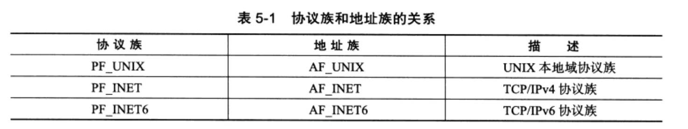
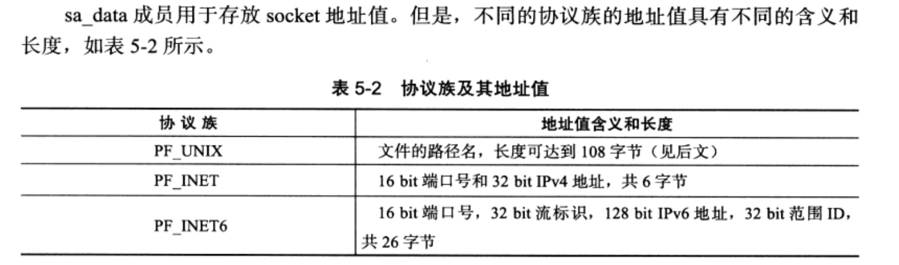
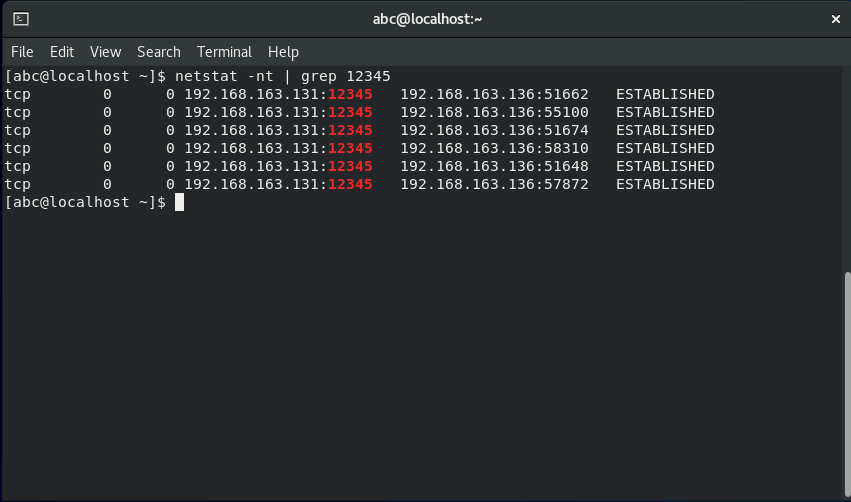
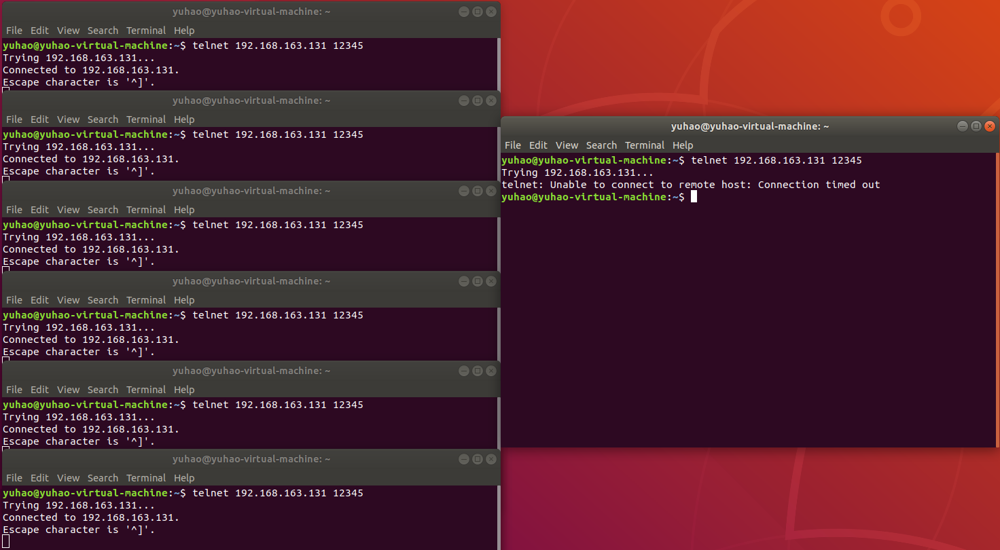
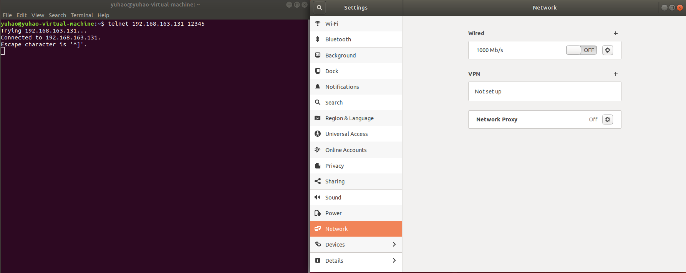
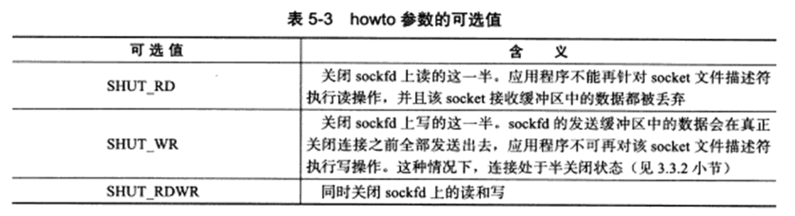
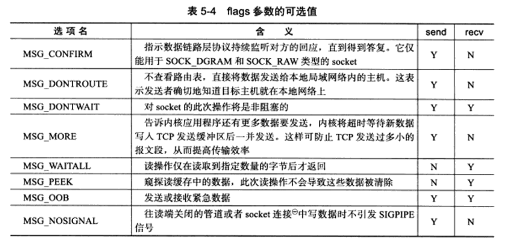
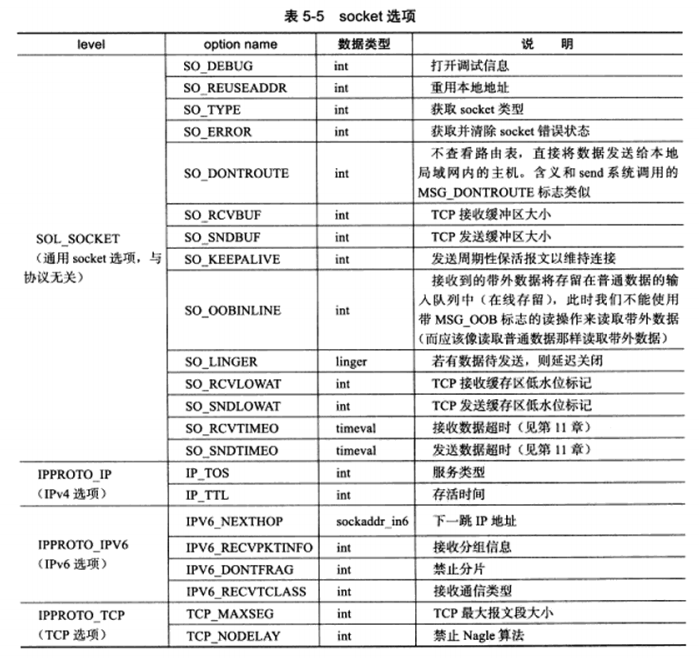

本章将从如下 3 个方面讨论 Linux 网络 API：

- socket 地址 API：socket 最开始的含义是一个 IP 地址和一个端口对，它唯一地表示了使用 TCP 通信的一端。
- socket 基础 API：socket 的主要 API 都定义在 `sys/socket.h` 头文件中，包括创建 socket、命名 socket、监听 socket、接受连接，发起连接，读写数据，获取地址信息以及读取和设置 socket 选项。
- 网络信息 API：Linux 提供了一套网络信息 API，以实现主机名和 IP 地址之间的转换，以及服务名称和端口号之间的转换。这些 API 都定义在 `netdb.h` 头文件中。

**结构体和函数源码来自于 Linux-kernel-4.18+ 的内核版本**

## 5.1 socket 地址 API

### 5.1.1 主机字节序和网络字节序

32 位机器的 CPU 一次可以装载 4 个字节，64位机器的 CPU 一次可以装载 8 个字节。

- 大端字节序是指一个整数的高位字节（55~63 bit、23~31 bit）存储在内存的**低地址**处，低位字节（0~7 bit）存储在内存的**高地址**处；
- 小端字节序是指一个整数的高位字节存储在内存的**高地址**处，低位字节存储在内存的**低地址**处。

下面程序可以检查机器的字节序：

```c
#include <stdio.h>

void byteorder() {
	union {
		short value;
		char union_bytes[sizeof(short)];
	} test;
	test.value = 0x0102;
	if (test.union_bytes[0] == 1 && test.union_bytes[1] == 2) {
		puts("big endian");
	} else if (test.union_bytes[0] == 2 && test.union_bytes[1] == 1) {
		puts("little endian");
	} else {
		puts("unkown");
	}
}

int main() {
	byteorder();
}
```

联合体是一种特殊的变量类型，它允许在其内部同时存放多个不同类型的变量，但所有成员共享同一块内存空间。上述代码定义了一个包含 short 类型变量 `value` 和 char 类型数组 `union_bytes` 的联合体，联合体占用内存空间为所有变量的最大值，二者均为 2 字节。当给 `value` 赋值为 `0x0102` 后，这个 16 位的整数值会被存放在联合体所共用的内存区域中。

在内存中，16 位的short类型变量 `value` 有两种可能的存储方式，取决于系统的字节序：

1. **大端模式**（Big Endian）：高位字节在前，低位字节在后，即内存中的布局可能是 `01 02`。
2. **小端模式**（Little Endian）：低位字节在前，高位字节在后，即内存中的布局可能是 `02 01`。

接下来，我们通过访问联合体内的 `union_bytes` 数组来查看 `value` 在内存中的实际布局。由于 `union_bytes` 是一个足够大的字符数组，它可以完整覆盖 `value` 所使用的内存区域。因此，通过检查 `union_bytes[0]` 和 `union_bytes[1]` 的值，就可以得知系统采用的是哪种字节序：

- 若 `union_bytes[0]` 为 1 且 `union_bytes[1]` 为 2，则系统为大端模式；
- 若 `union_bytes[0]` 为 2 且 `union_bytes[1]` 为 1，则系统为小端模式。

现代 PC 大都采用小端字节序。为了防止不同字节序的机器之间的通信出现问题，解决方法是：发送方总是把要发送的数据转化为大端字节序数据后再发送，接收端根据自身的情况，选择转换到小端字节序或者不转换。因此大端字节序又被称为**网络字节序**。

Linux 提供了如下 4 个函数来完成主机字节序和网络字节序的转换：

1. **htons()**（Host To Network Short）：将主机字节序的无符号短整型（`unsigned short`）转换为网络字节序。

   ```c
   uint16_t htons(uint16_t hostshort);
   ```

2. **ntohs()** （Network To Host Short）：将网络字节序的无符号短整型转换为主机字节序。

   ```c
   uint16_t ntohs(uint16_t netshort);
   ```

3. **htonl()**（Host To Network Long）：将主机字节序的无符号长整型（`unsigned long`，通常指32位整数）转换为网络字节序。

   ```c
   uint32_t htonl(uint32_t hostlong);
   ```

4. **ntohl()** （Network To Host Long）：将网络字节序的无符号长整型转换为主机字节序。

   ```c
   uint32_t ntohl(uint32_t netlong);
   ```

### 5.1.2 通用 socket 地址

socket 地址结构体：

```c
#include <bits/socket.h>
struct sockaddr
{
    sa_family_t sa_family; // 地址族，比如 AF_INET、AF_INET6 或 AF_UNIX
    char        sa_data[14]; // 实际的协议地址，根据地址族的不同，内容和长度也不同
};
```





14 字节的 sa_data 无法满足所有协议族的地址值，因此 Linux 定义了新的通用 socket 地址结构体：

```c
struct sockaddr_storage
{
    sa_family_t ss_family;     // 地址族，例如 AF_INET、AF_INET6 或其他
    // 在某些实现中可能会有额外的字段
    unsigned long int __ss_align // 用于对齐的字段，确保整个结构体满足特定对齐要求

    // 下面这部分是为了兼容各种不同的 socket 地址结构而保留的足够大的空间
    // 具体内容取决于实际使用的地址类型
    // 对于不同的 socket 地址类型，只需要使用 ss_family 指定的地址族对应的结构体去解析即可
    char        __ss_padding[SS_SIZE - sizeof(sa_family_t)]; // 填充字节，确保整体大小足以容纳任何 sockaddr 结构
};

#define SS_SIZE           sizeof(struct sockaddr_storage)
#define _SS_MAXSIZE       128 // 这是一个示例值，具体大小由系统决定，保证足够容纳最大的 sockaddr 结构
#define _SS_ALIGNSIZE     (__alignof__(__int64_t)) // 同样是示例值，具体对齐大小由系统决定
```

### 5.1.3 专用 socket 地址

Linux 为各个协议族提供了专门的 socket 地址结构体。

UNIX 本地域协议族使用如下专用的 socket 结构体：

```c
struct sockaddr_un
{
    sa_family_t sin_family;	/* 地址族：AF_UNIX */
    char sun_path[108];		/* 文件路径名 */
};
```

TCP/IP 协议族有 `sockaddr_in` 和 `sockaddr_in6` 两个专用 socket 地址结构体：

```c
struct sockaddr_in
{
    sa_family_t sin_family;		/* 地址族：AF_INET */
    uint32_t sin_port;			/* 端口号：要用网络字节序表示  */
    struct in_addr sin_addr;	/* IPv4 结构体  */
};

struct in_addr
{
	uint32_t s_addr;			/* IPv4 地址：要用网络字节序表示  */
};

struct sockaddr_in6
{
    sa_family_t sin_family;		/* 地址族：AF_INET6 */
    uint32_t sin6_port;			/* 端口号：要用网络字节序表示 */
    uint32_t sin6_flowinfo;		/* IPv6 流信息，应该设置为 0 */
    struct in6_addr sin6_addr;	/* IPv6 地址结构体 */
    uint32_t sin6_scope_id;		/* IPv6 scope-id */
};

struct in6_addr
{
    /* IPv6 地址  */
	union
  	{
		uint8_t	__u6_addr8[16];
		uint16_t __u6_addr16[8];
		uint32_t __u6_addr32[4];
    } __in6_u;
}
```

所有专用 socket 地址类型的变量在实际使用时都需要**强制转化**为通用的 socket 地址类型 `sockaddr`，因为所有的 socket 编程接口使用的地址参数类型都是 `sockaddr`。

### 5.1.4 IP 地址转换函数

下面三个函数用于表示 IPv4 地址和用网络字节序整数表示的 IPv4 地址之间的转换：

```c
#include <arpa/inet.h>
in_addr_t inet_addr (const char *__cp);
int inet_aton (const char *__cp, struct in_addr *__inp);
char *inet_ntoa (struct in_addr __in);
```

`inet_addr` 函数将点分十进制字符串表示的 IPv4 地址转化为网络字节序整数表示的 IPv4 地址，它失败时返回 `INADDR_NONE`。

`inet_aton` 函数完成和 `inet_addr` 同样的功能，但是将转换结果存储于参数 `inp` 指向的地址结构中。函数执行成功时返回 1，失败时返回 0。

`inet_ntoa` 函数将网络字节序整数表示的 IPv4 地址转化为用点分十进制字符串表示的 IPv4 地址。但是该函数内部用一个静态变量存储转化结果，函数的返回值指向该静态内存。因此该函数是**不可重入**的。

## 5.2 创建 socket

socket 是可读、可写、可控制、可关闭的文件描述符。下面的 socket 系统调用创建一个 socket：

```c
#include <sys/socket.h>
int socket (int domain, int type, int protocol);
```

该函数的参数列表解析如下：

- `domain` 参数告诉系统使用哪个底层协议族。对 TCP/IP 协议族而言，该参数应该设置为 `PF_INET` （Protocol Family of Internet，用于 IPv4）或 `PF_INET6`（用于 IPv6），对 UNIX 本地域协议族而言，该参数应该设置为 `PF_UNIX`；
- `type` 参数指定服务类型。服务类型主要有 `SOCK_STREAM` 服务（流服务）和 `SOCK_UGRAN`（数据报服务）。对 TCP/IP 协议族而言，其值取 `SOCK_STREAM` 表示传输层采用 TCP 协议，否则表示传输层采用 UDP 协议。`type` 参数还可以接受服务类型与下面两个**重要标志**相与的值：`SOCK_NONBLOCK` 和 `SOCK_CLOEXEC`。它们分别表示将 socket 设置为非阻塞的，以及用 fork 调用创建子进程时在子进程中关闭该 socket；
- `protocol` 参数在前两个参数构成的协议集合下，再选择一个具体的协议，但这个值通过设置为 0，表示使用前两个参数确定的默认协议。

`socket` 系统调用成功时返回一个 socket 文件描述符，失败时返回 -1 并设置 errno

## 5.3 命名 socket

客户端通过匿名方式，使用操作系统自动分配的 socket 地址。服务端创建 socket 后，只有命名后客户端才可以连接它。命名 socket 的系统调用是 `bind`，其定义如下：

```c
#include <sys/socket.h>
int bind (int sockfd, const struct sockaddr * my_addr, socklen_t addrlen);
```

`bind` 将 `my_addr` 所指向的 socket 地址分配给未命名的 `sockfd` 文件描述符，`addrlen` 参数指出该 socket 地址的长度。

`bind` 成功时返回 0，失败则返回 -1 并设置 errno，其中两种常见的 errno 是：

- `EACCESS`：被绑定的地址是受保护的地址，仅超级用户可以访问。例如普通用户将 socket 绑定到知名服务端口（端口号为 0~1023）上时，将返回该错误；
- `EADDRINUSE`：被绑定的地址正在使用中。比如将 socket 绑定到一个处于 TIME_WAIT 状态的 socket 地址。

## 5.4 监听 socket

socket 被命名后，还不能马上接受客户端连接，需要通过 `listen` 系统调用创建一个监听队列以存放待处理的客户连接：

```c
#include <sys/socket.h>
int listen (int sockfd, int backlog);
```

`sockfd` 指定被监听的 socket，`backlog` 参数指定**处于完全连接状态的 socket 上限**）。如果超过 `backlog`，服务器将不受理新的客户连接，客户端也会收到 `ECONNREFUSED` 错误信息。

如下代码研究 `backlog` 参数对 `listen` 系统调用的影响：

```c
static bool stop = false;

static void handle_term(int sig) {
    stop = true;
}

int main(int argc, char* argv[]) {
    signal(SIGTERM, handle_term);

    const char* ip = "192.168.163.131";
    int port = 12345;
    int backlog = 5;

    int sock = socket(PF_INET, SOCK_STREAM, 0);
    assert(sock >= 0);

    struct sockaddr_in address;
    bzero(&address, sizeof(address));
    address.sin_family = AF_INET;
    inet_pton(AF_INET, ip, &address.sin_addr);
    address.sin_port = htons(port);

    int ret = bind(sock, (struct sockaddr*) &address, sizeof(address));
    assert(ret != -1);

    ret = listen(sock, backlog);
    assert(ret != -1);

	while (!stop) {
		sleep(1);
	}

    close(sock);
    return 0;
}
```

在 CentOS 上执行上述服务端代码，并不断查询连接状态：

```bash
netstat -nt | grep 12345
```



在 Ubuntu 上创建多个 telnet 客户端连接：

```bash
telnet 192.168.163.131 12345 	# 在多个终端窗口执行
```



可以发现，**最多只能有 6 个处于 ESTABLEISHED 状态的连接**。完整连接最多有 `backlog + 1` 个。

## 5.5 接受连接

对于服务端来说，系统调用 `accept` 从 `listen` 监听队列中接受一个连接：

```c
#include <sys/socket.h>
int accept (int sockfd, struct sockaddr *addr, socklen_t *addr_len);
```

`sockfd` 参数是执行过 `listen` 系统调用的监听 socket，`addr` 参数用来获取被接受连接的远端 socket 地址（或者说是客户端 socket 地址），该 socket 地址的长度由 `addrlen` 参数指出。`accept` 成功时返回一个新的连接 socket，该 socket 唯一地标识了被接受的这个连接，服务器可通过读写该 socket 与对应的客户端通信。`accept` 失败时返回 -1 并设置 `errno`。

考虑如下情况：如果监听队列中处于 ESTABLEISHED 状态的连接对应的客户端出现了**网络异常**或者**提前退出**，那么服务器对这个连接执行的 `accept` 调用是否成功？

```c
int main() {
	const char* ip = "192.168.163.131";
    int port = 12345;

	struct sockaddr_in address;
	bzero(&address, sizeof(address));
	address.sin_family = AF_INET;
	inet_pton(AF_INET, ip, &address.sin_addr);
	address.sin_port = htons(port);

	int sock = socket(PF_INET, SOCK_STREAM, 0);
	assert(sock >= 0);

	int ret = bind(sock, (struct sockaddr*) &address, sizeof(address));
	assert(ret != -1);

	ret = listen(sock, 5);
	assert(ret != -1);

	/* 暂停一段时间使得客户端连接和相关操作（掉线或退出）完成 */
	sleep(20);

	struct sockaddr_in client;
	socklen_t client_addrlength = sizeof(client);
	int connfd = accept(sock, (struct sockaddr*) &client, &client_addrlength);
	if (connfd < 0) {
		printf("error: %s\n", strerror(errno));
	} else {
		/* 接受连接成功则打印出客户端的 IP 地址和端口号 */
		char remote[INET_ADDRSTRLEN];
		const char *clinet_ip = inet_ntop(AF_INET, &client.sin_addr, remote, INET_ADDRSTRLEN);
		int clinet_port = ntohs(client.sin_port);
		printf("connected with ip: %s and port %d\n", clinet_ip, clinet_port);
		close(connfd);
	}

	close(sock);
	return 0;
}
```

在 CentOS 上执行该服务器程序，并在 Ubuntu 上执行 telnet 命令来连接该服务器程序：

```bash
telnet 192.168.163.131 12345
```

启动 telnet 程序的 20 秒内断开该客户端的网络连接，发现 `accept` 调用能够正常返回。



服务器的输出如下：

```bash
connected with ip: 192.168.163.136 and port 46988
```

接着，在服务器上运行 netstat 命令查看 `accept` 返回的连接 socket 状态：

```bash
tcp        0      0 192.168.163.131:12345   192.168.163.136:46988   ESTABLISHED
```

上述命令的输出说明，`accept` 调用对客户端网络断开并不知情。接下来重新执行上述过程，**在建立连接后立即退出客户端程序，并且关闭网络连接**，这次 `accept` 调用同样正常返回，服务端的输出如下：

```bash
connected with ip: 192.168.163.136 and port 52268
```

再次在服务器上执行 netstat 命令：

```bash
tcp        1      0 192.168.163.131:12345   192.168.163.136:52268   CLOSE_WAIT
```

由此可见，`accept` 只是从监听队列中取出连接，而不论连接处于何种状态（如上面的 ESTABLISHED 状态和 状态），更不关心任何网络状况的变化。

## 5.6 发起连接

客户端通过如下系统调用来主动与服务器建立连接：

```c
int connect (int sockfd, const struct sockaddr *serv_addr, socklen_t addrlen);
```

`connect` 成功时返回 0，失败时返回 -1 并设置 `errno`，常见的 `errno` 是：

- `ECONNREFUSED`：目标端口不存在，连接被拒绝；
- `ETIMEOUT`：连接超时。

## 5.7 关闭连接

关闭一个连接实际上就是关闭该连接对应的文件描述符，和普通文件描述符一样，采用 `close` 系统调用完成：

```c
#include <unistd.h>
int close(int fd);
```

`close` 系统调用并非总是立即关闭一个连接，而是将 `fd` 的引用计数减一，只有当 `fd` 的引用计数为 0 时，才真正关闭连接。多进程程序中，一次 `fork` 系统调用默认将父进程中打开的 socket 的引用计数加一，因此必须在父子进程中都对该 socket 执行 close 调用才能将连接关闭。

如果无论如何都要立刻终止连接，可以使用 `shutdown` 系统调用：

```c
#include <sys/socket.h>
int shutdown(int sockfd, int howto);
```

`howto` 参数决定了该函数的行为，它是下标中的某个值：



## 5.8 数据读写

### 5.8.1 TCP 数据读写

TCP 数据读写的系统调用是：
```c++
#include <sys/socket.h>
ssize_t recv(int sockfd, void *buf, size_t len, int flags);
ssize_t send(int sockfd, const void *buf, size_t len, int flags);
```

`flags` 参数为数据收发提供了额外的控制，可以取下标选项中的一个或几个，只对 `send` 和 `recv` 当前调用生效：



Ubuntu 上客户端发送带外数据的代码：

```c++
int main(int argc, char* argv[]) {
    const char* ip = "192.168.163.131";
    int port = 12345;

    struct sockaddr_in server_address;
    bzero(&server_address, sizeof(server_address));
    server_address.sin_family = AF_INET;
    inet_pton(AF_INET, ip, &server_address.sin_addr);
    server_address.sin_port = htons(port);

    int sockfd = socket(PF_INET, SOCK_STREAM, 0);
    assert(sockfd >= 0);
    if (connect(sockfd, (struct sockaddr*)&server_address, sizeof(server_address)) < 0) {
        printf("connection failed\n");
    } else {
        printf("send oob data out\n");
        const char* oob_data = "abc";
        const char* normal_data = "123";
        send(sockfd, normal_data, strlen(normal_data), 0);
        send(sockfd, oob_data, strlen(oob_data), MSG_OOB);
        send(sockfd, normal_data, strlen(normal_data), 0);
    }

    close(sockfd);
    return 0;
}
```

CentOS 上服务端接受带外数据的代码：

```c++
#define BUF_SIZE 1024

int main(int argc, char* argv[]) {
    const char* ip = "192.168.163.131";
    int port = 12345;
    int backlog = 5;

    struct sockaddr_in address;
    bzero(&address, sizeof(address));
    address.sin_family = AF_INET;
    inet_pton(AF_INET, ip, &address.sin_addr);
    address.sin_port = htons(port);

    int sock = socket(PF_INET, SOCK_STREAM, 0);
    assert(sock >= 0);

    int ret = bind(sock, (struct sockaddr*)&address, sizeof(address));
    assert(ret != -1);

    ret = listen(sock, backlog);
    assert(ret != -1);

    struct sockaddr_in client;
    socklen_t client_addrlength = sizeof(client);
    while (1) {
        int connfd = accept(sock, (struct sockaddr*)&client, &client_addrlength);
        if (connfd < 0) {
            printf("errno is: %s\n", strerror(errno));
        } else {
            char buffer[BUF_SIZE];

            memset(buffer, '\0', BUF_SIZE);
            ret = recv(connfd, buffer, BUF_SIZE - 1, 0);
            printf("got %d bytes of normal data '%s'\n", ret, buffer);

            memset(buffer, '\0', BUF_SIZE);
            ret = recv(connfd, buffer, BUF_SIZE - 1, MSG_OOB);
            printf("got %d bytes of oob data '%s'\n", ret, buffer);

            memset(buffer, '\0', BUF_SIZE);
            ret = recv(connfd, buffer, BUF_SIZE - 1, 0);
            printf("got %d bytes of normal data '%s'\n", ret, buffer);

            close(connfd);
        }
    }
    close(sock);
    return 0;
}
```

首先执行服务器程序，然后在服务器上执行 `sudo tcpdump -ntx -i ens160 port 12345`，最后执行客户端程序。

服务器程序的输出如下：

```
got 5 bytes of normal data '123ab'
got 1 bytes of oob data 'c'
got 3 bytes of normal data '123'
```

仅有最后一个字符 'c' 被服务器当成真正的带外数据接收，服务器对正常数据的接收被带外数据截断。服务端上 tcpdump 和带外数据相关的抓包内容为：

```
IP 192.168.163.136.45766 > 192.168.163.131.italk: Flags [P.U], seq 4:10, ack 1, win 502, urg 3, options [nop,nop,TS val 3871086356 ecr 1888448966], length 6
```

### 5.8.2 UDP 数据读写

UDP 数据读写的系统调用是：

```c++
#include <sys/socket.h>
ssize_t recvfrom (int sockfd, void *buf, size_t len, int flags, struct sockaddr *src_addr, socklen_t *addrlen);
ssize_t sendto (int sockfd, const void *buf, size_t len, int flags, const struct sockaddr *dest_addr, socklen_t *addrlen);
```

### 5.8.3 通用数据读写函数

socket 变成接口提供了通用数据读写系统调用，不仅能用于 TCP 流数据，也能用于 UDP 流数据报：

```c++
#include <sys/socket.h>
ssize_t recvmsg (int sockfd, struct msghdr *msg, int flags);
ssize_t recvmsg (int sockfd, struct msghdr *msg, int flags);
```

`msg` 参数是 `msghdr` 结构体类型的指针，`msghdr` 结构体的定义如下：

```c++
struct msghdr {
    void* msg_name;        		/* socket 地址  */
    socklen_t msg_namelen; 		/* socket 地址的长度  */
    struct iovec* msg_iov; 		/* 分散的内存块  */
    size_t msg_iovlen;     		/* 分散的内存块数量  */
    void* msg_control;     		/* 指向辅助数据的起始位置 */
    size_t msg_controllen; 		/* 辅助数据的大小  */
    int msg_flags; 				/* 复制函数中的 flags 参数，并在调用过程中更新  */
};
```

`msg_name` 成员指向一个 socket 地址结构变量。它指定通信对方的 socket 地址。对于面向连接的 TCP 协议，该成员没有意义，必须设置为 NULL。这是因为对数据流 socket 而言，对方的地址已经知道。

`msg_iov` 成员是 `iovec` 结构体类型的指针：

```c++
struct iovec {
    void* iov_base; /* 内存的起始地址  */
    size_t iov_len; /* 这块内存的长度  */
};
```

对于 `recvmsg` 而言，数据将被读取并存放在 `msg_iovlen` 块分散的内存中，这些内存的位置和长度则由 `msg_iov` 指向的数组指定，这称为**分散读 scatter read**；对于 `sendmsg` 而言，`msg_iovlen` 块分散内存中的数据将被一并发送，这称为**集中写 gather write**。

`flags` 参数的含义与 `send/recv` 相同。

## 5.9 带外标记

内核通知应用程序带外数据到达的两种常见方式是：

- I/O 复用产生的异常事件
- SIGURG 信号

获取带外数据在数据流中具体位置的系统调用为：

```c++
#include <sys/socket.h>
int sockatmark(int sockfd);
```

## 5.10 地址信息函数

获取本端和远端的 socket 地址的系统调用为：

```c++
#include <sys/socket.h>
int getsockname (int sockfd, struct sockaddr *address, socklen_t *address_len);
int getpeername (int sockfd, struct sockaddr *address, socklen_t *address_len);
```

`getsockname` 获取 `sockfd` 对应的本端的 socket 地址，并将其存储于 `address` 参数指定的内存中；`getpeername` 获取`sockfd` 对应的远端的 socket 地址，并将其存储于 `address` 参数指定的内存中；

## 5.11 socket 选项

读取和设置 socket 文件描述符属性的方法：

```c++
#include <sys/socket.h>
int getsockopt (int sockfd, int level, int option_name, void *option_value, socklen_t *option_len);
int setsockopt (int sockfd, int level, int option_name, const void *option_value, socklen_t *option_len);
```

常见 socket 选项如下表所示：



### 5.11.1 SO_REUSEADDR 选项

设置 socket 选项 `SO_REUSEADDR` 可以强制使用处于 TIME_WAIT 状态的连接占用的 socket 地址，实现方式如下所示：

```c++
const char *ip = "192.168.163.131";
uint16_t port = 12345;
int sock = socket(PF_INET, SOCK_STREAM, 0);
assert(sock >= 0);
int reuse = 1;
setsockopt(sock, SOL_SOCKET, SO_REUSEADDR, &reuse, sizeof(reuse));

struct sockaddr_in address;
bzero(&address, sizeof(address));
address.sin_family = AF_INET;
inet_pton(AF_INET, ip, &address.sin_addr);
address.sin_port = htons(port);
int ret = bind(sock, (struct sockaddr*)&address, sizeof(address));
```

此外，也可以通过修改内核参数 `/proc/sys/net/ipv4/tcp_tw_recycle` 来快速回收被关闭的 socket，从而使得 TCP 连接根本不进入 TIME_WAIT 状态，进而允许应用程序立即重用本地的 socket 地址。

### 5.11.2 SO_RCVBUF 和 SO_SNDBUF 选项

`SO_RCVBUF` 和 `SO_SNDBUF` 选项分别表示 TCP 接收缓冲区和发送缓冲区的大小，但是 `setsockopt` 设置大小时，系统会进行一定调整修改，并且不得小于某个最小值（不同系统和内核版本可能不同）。可以通过修改内核参数 `/proc/sys/net/ipv4/tcp_rmem` 和 `/proc/sys/net/ipv4/tcp_wmem` 来强制修改 TCP 接收缓冲区和发送缓冲区的大小没有最小值限制。

Ubuntu 客户端程序代码：

```c++
#define BUFFER_SIZE 1024 * 5

int main(int argc, char* argv[]) {
    const char* ip = "192.168.163.131";
    int port = 12345;

    struct sockaddr_in server_address;
    bzero(&server_address, sizeof(server_address));
    server_address.sin_family = AF_INET;
    inet_pton(AF_INET, ip, &server_address.sin_addr);
    server_address.sin_port = htons(port);

    int sock = socket(PF_INET, SOCK_STREAM, 0);
    assert(sock >= 0);

    int sendbuf = 2000;
    int len = sizeof(sendbuf);
    setsockopt(sock, SOL_SOCKET, SO_SNDBUF, &sendbuf, sizeof(sendbuf));
    getsockopt(sock, SOL_SOCKET, SO_SNDBUF, &sendbuf, (socklen_t*)&len);
    printf("the tcp send buffer size after setting is %d\n", sendbuf);

    if (connect(sock, (struct sockaddr*)&server_address,
                sizeof(server_address)) != -1) {
        char buffer[BUFFER_SIZE];
        memset(buffer, 'a', BUFFER_SIZE);
        send(sock, buffer, BUFFER_SIZE, 0);
    }
    close(sock);
    return 0;
}
```

CentOS 服务器程序代码：

```c++
#define BUFFER_SIZE 1024

int main(int argc, char* argv[]) {
    const char* ip = "192.168.163.131";
    int port = 12345;
    int backlog = 5;

    struct sockaddr_in address;
    bzero(&address, sizeof(address));
    address.sin_family = AF_INET;
    inet_pton(AF_INET, ip, &address.sin_addr);
    address.sin_port = htons(port);

    int sock = socket(PF_INET, SOCK_STREAM, 0);
    assert(sock >= 0);
    int recvbuf = 50;
    int len = sizeof(recvbuf);
    setsockopt(sock, SOL_SOCKET, SO_RCVBUF, &recvbuf, sizeof(recvbuf));
    getsockopt(sock, SOL_SOCKET, SO_RCVBUF, &recvbuf, (socklen_t*)&len);
    printf("the receive buffer size after settting is %d\n", recvbuf);

    int ret = bind(sock, (struct sockaddr*)&address, sizeof(address));
    assert(ret != -1);

    ret = listen(sock, backlog);
    assert(ret != -1);

    struct sockaddr_in client;
    socklen_t client_addrlength = sizeof(client);
    int connfd = accept(sock, (struct sockaddr*)&client, &client_addrlength);
    if (connfd < 0) {
        printf("errno is: %d\n", errno);
    } else {
        char buffer[BUFFER_SIZE];
        memset(buffer, '\0', BUFFER_SIZE);
        int buff_size = 0;
        while (buff_size = recv(connfd, buffer, BUFFER_SIZE - 1, 0) > 0) {
            printf("get %d message : %s\n", strlen(buffer), buffer);
            memset(buffer, '\0', BUFFER_SIZE);
        }
        close(connfd);
    }

    close(sock);
    return 0;
}
```

服务端输出为：

```
the receive buffer size after settting is 2304
```

客户端输出为：

```
the tcp send buffer size after setting is 4608
```

此次通信的 `tcpdump` 输出：

```
IP 192.168.163.136.49768 > 192.168.163.131.italk: Flags [S], seq 2486525341, win 64240, options [mss 1460,sackOK,TS val 3880261238 ecr 0,nop,wscale 7], length 0

IP 192.168.163.131.italk > 192.168.163.136.49768: Flags [S.], seq 1209927837, ack 2486525342, win 1152, options [mss 1460,sackOK,TS val 1897623934 ecr 3880261238,nop,wscale 0], length 0

IP 192.168.163.136.49768 > 192.168.163.131.italk: Flags [.], ack 1, win 502, options [nop,nop,TS val 3880261239 ecr 1897623934], length 0

IP 192.168.163.136.49768 > 192.168.163.131.italk: Flags [P.], seq 1:1153, ack 1, win 502, options [nop,nop,TS val 3880261240 ecr 1897623934], length 1152

IP 192.168.163.131.italk > 192.168.163.136.49768: Flags [.], ack 1153, win 0, options [nop,nop,TS val 1897623937 ecr 3880261240], length 0

IP 192.168.163.131.italk > 192.168.163.136.49768: Flags [.], ack 1153, win 1152, options [nop,nop,TS val 1897623938 ecr 3880261240], length 0

IP 192.168.163.136.49768 > 192.168.163.131.italk: Flags [P.], seq 1153:1729, ack 1, win 502, options [nop,nop,TS val 3880261242 ecr 1897623938], length 576

IP 192.168.163.136.49768 > 192.168.163.131.italk: Flags [.], seq 1729:2305, ack 1, win 502, options [nop,nop,TS val 3880261242 ecr 1897623938], length 576

IP 192.168.163.131.italk > 192.168.163.136.49768: Flags [.], ack 2305, win 0, options [nop,nop,TS val 1897623939 ecr 3880261242], length 0

IP 192.168.163.131.italk > 192.168.163.136.49768: Flags [.], ack 2305, win 1152, options [nop,nop,TS val 1897623939 ecr 3880261242], length 0

IP 192.168.163.136.49768 > 192.168.163.131.italk: Flags [P.], seq 2305:2881, ack 1, win 502, options [nop,nop,TS val 3880261243 ecr 1897623939], length 576

IP 192.168.163.136.49768 > 192.168.163.131.italk: Flags [.], seq 2881:3457, ack 1, win 502, options [nop,nop,TS val 3880261244 ecr 1897623939], length 576

IP 192.168.163.131.italk > 192.168.163.136.49768: Flags [.], ack 2881, win 1152, options [nop,nop,TS val 1897623940 ecr 3880261243], length 0

IP 192.168.163.131.italk > 192.168.163.136.49768: Flags [.], ack 3457, win 1152, options [nop,nop,TS val 1897623940 ecr 3880261244], length 0

IP 192.168.163.136.49768 > 192.168.163.131.italk: Flags [P.], seq 3457:4033, ack 1, win 502, options [nop,nop,TS val 3880261244 ecr 1897623940], length 576

IP 192.168.163.131.italk > 192.168.163.136.49768: Flags [.], ack 4033, win 1152, options [nop,nop,TS val 1897623940 ecr 3880261244], length 0

IP 192.168.163.136.49768 > 192.168.163.131.italk: Flags [.], seq 4033:4609, ack 1, win 502, options [nop,nop,TS val 3880261244 ecr 1897623940], length 576

IP 192.168.163.136.49768 > 192.168.163.131.italk: Flags [FP.], seq 4609:5121, ack 1, win 502, options [nop,nop,TS val 3880261245 ecr 1897623940], length 512

IP 192.168.163.131.italk > 192.168.163.136.49768: Flags [.], ack 4609, win 1152, options [nop,nop,TS val 1897623941 ecr 3880261244], length 0

IP 192.168.163.131.italk > 192.168.163.136.49768: Flags [F.], seq 1, ack 5122, win 1152, options [nop,nop,TS val 1897623941 ecr 3880261245], length 0

IP 192.168.163.136.49768 > 192.168.163.131.italk: Flags [.], ack 2, win 502, options [nop,nop,TS val 3880261246 ecr 1897623941], length 0
```

### 5.11.3 SO_RCVLOWAT 和 SO_SNDLOWAT 选项

`SO_RCVLOWAT` 和 `SO_SNDLOWAT` 选项分别表示 TCP 接收缓冲区和发送缓冲区的低水位标记，它们一般被 I/O 多路复用系统调用来判断 socket 是否可读或可写。

默认情况下，TCP 接收缓冲区和发送缓冲区的低水位标记均为 1 字节。

### 5.11.4 SO_LINGER 选项

`SO_LINGER` 选项用于控制 `close` 系统调用在关闭 TCP 连接时的行为。默认情况下，当使用 `close` 系统第哦啊用关闭一个 socket 时，将立刻返回，TCP 模块负责把该 socket 对应的 TCP 发送缓冲区中残留的数据发送给对方。
